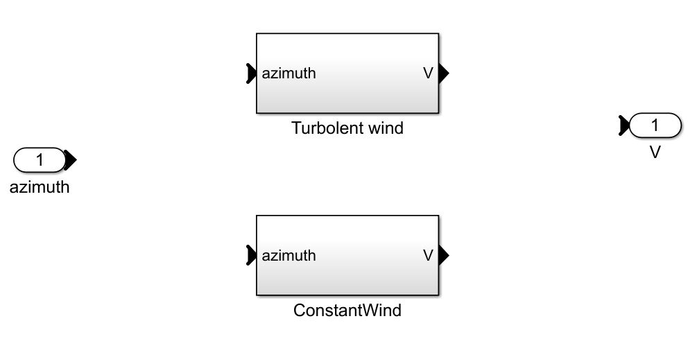
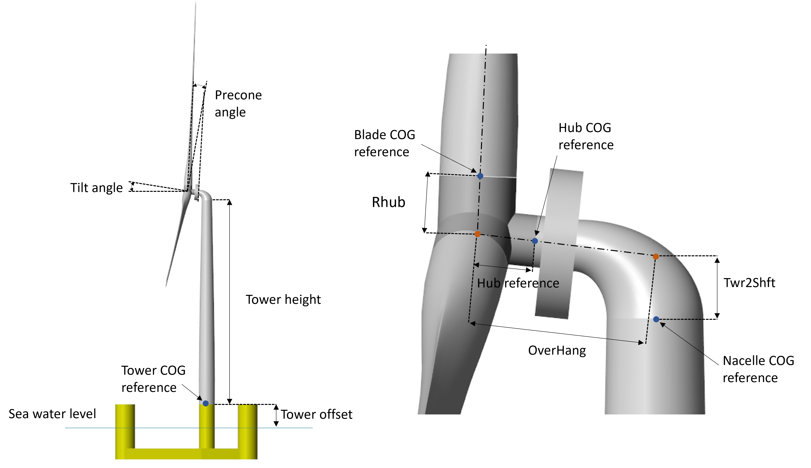

.. _most-advanced_features:

Advanced Features
=================

Mooring Features
-------------------

MOST includes the possibility to simulate a mooring look-up table which is able to simulate a quasi-static, nonlinear mooring system. Specifically, it is possible
to simulate a mooring system consisting of a number of lines suspended between two points (anchor and fairlead) and angularly equispaced.
This option is based on the catenary equations similarly to the open-source code `MAP++ <https://map-plus-plus.readthedocs.io/en/latest/>`_. 

Mooring look-up table
^^^^^^^^^^^^^^^

In the simulink model, forces and torques due to moorings are determined through 6 different look-up tables having the 6 degrees of freedom surge, sway, heave, 
roll, pitch and yaw as inputs. The breakpoints (related to the inputs) and the outpus (Fx, Fy, Fz, Mx, My and Mz, i.e., the mooring loads) are contained within a 
data structure called "moor_matrix" and created through the "Create_Mooring_Matrix.m" script, in which the following characteristics are specified: 

* Water density (kg/m^3): :code:`rho_water`
* Gravity acceleration (m/s^2): :code:`gravity`
* Water depth (m): :code:`depth`
* Mooring line diameter (m): :code:`d` 
* Linear mass (kg/m): :code:`linear_mass` 
* Number of lines: :code:`number_lines`
* Fairlead and anchor positions of the first line (m): :code:`nodes`
* Mooring lines unstretched length (m): :code:`L` 
* Sectional stiffness (N): :code:`EA`   
* Seabed friction coefficient: :code:`CB`
 

In addition, the user can specify the domain of the look-up tables, specifically:

* Amplitude and discretisation along surge direction (m): :code:`X` 
* Amplitude and discretisation along sway direction (m): :code:`Y` 
* Amplitude and discretisation along heave direction (m): :code:`Z` 
* Amplitude and discretisation around roll axis (rad): :code:`RX` 
* Amplitude and discretisation around pitch axis (rad): :code:`RY` 
* Amplitude and discretisation around yaw axis (rad): :code:`RZ`  

The code for generating the "moor_matrix" structure at first calculates the positions of the fairleads and anchors of the other lines, 
in accordance with the specified number and in an angularly equispaced manner, after which, for each combination of the inputs (surge,
sway, heave, roll, pitch and yaw) it calculates the new positions of the fairleads. Given these positions, for each line it performs a
numerical optimization by which the vertical force and the horizontal force (along the projection of the line in the xy plane) are 
calculated. Specifically, by means of the typical catenary equations, it is possible to calculate (known the characteristics of a line) 
the above-mentioned vertical and horizontal forces having as input the vertical and horizontal distances between the two ends of the 
line, so, in this case the optimization procedure searches for forces such that the distances are as close as possible to those 
specified. Once the vertical and horizontal forces are calculated for each line, the resulting force and torque in the global reference 
frame applied to the origin of the reference frame attached to the structure are determined.

Wind Features
-------------------
Wind speed can be defined choosing between the two options of the wind class:

* Constant wind conditions
* Turbolent wind conditions

The constant wind speed is constant in time and space while the second option includes the temporal and spatial turbulence of the wind.

TurbSim look-up table
^^^^^^^^^^^^^^^
The simulation of the wind turbine for turbolent wind conditions requires the generation of a look-up table which relates the temporal 
and spatial variation of wind speed on the wind turbine rotor plane (yz plane). Therefore the wind speed is discretized for 3 variable (2 spatial parameters (y and z) and the time).
The look-up table is generated using "run_turbsim" which computes turbolent wind speeds based on `Turbsim <https://www.nrel.gov/wind/nwtc/turbsim.html>`_ executable. 
Turbolent wind speed values can be defined in "run_turbsim" while other Turbsim parameters can be set-up in the "Turbsim_inputfile.txt" file. A detailed description of using Turbsim 
is given in the `Turbsim <https://www.nrel.gov/wind/nwtc/turbsim.html>`_ page.

Aerodynamic wind loads calculation in the Simulink model requires the average wind speed for each blade. This is found computing the average wind speed for four discretized points along the blade length during the simulation. Relative wind speed for each blade is computed including the influence of the horizontal hub speed and the pitch and yaw rotation of the hub.

Wind turbine Features
-------------------
Wind turbine properties
^^^^^^^^^^^^^^^
The wind turbine is modelled as a multi-body system including the tower, nacelle, hub and the blades. 
Mass, inertia and properties of each wind turbine component are defined in a structure that can be generated using the provided "WTproperties" MATLAB code. The following parameters are 
common for all components:

* Mass
* Inertia
* Center of Gravity (COG) position relative to the reference location.

Reference locations for relative COG of each wind turbine component are described in the followind figure. 
The following parameters are also defined to describe fully the wind turbine system:

* Tower offset position relative to sea water level (m): :code:`tower.offset`
* Tower height (m): :code:`tower.height` (See Figure)
* Twr2Shft (deg): :code:`nacelle.Twr2Shft` (See Figure)
* Overhang (m): :code:`hub.overhang` (See Figure)
* Hub reference (m): :code:`hub.reference` (See Figure)
* Hub radius (m): :code:`hub.Rhub` (Rhub) 
* Tilt angle (deg): :code:`nacelle.tiltangle` (See Figure)
* Precone angle (deg): :code:`hub.precone` (See Figure)
* Blade discretisation nodes to average the wind speed: :code:`blade.bladeDiscr`
* Generator efficiency: :code:`gen_eff`
* CAD file path

Aerodynamic loads
^^^^^^^^^^^^^^^

Control
^^^^^^^^^^^^^^^

TODO - describe the MOST example, how to change it, what the varies parameters mean, etc
Mirror the WEC-Sim user manual/advanced features section
