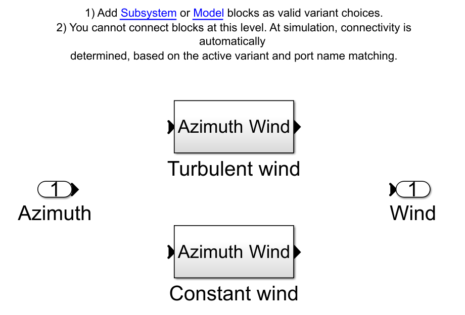

.. _most-advanced_features:

*****************
Advanced Features
*****************

In this section, a more detailed look will be taken at some of the operational aspects of the new features introduced with MOST. Specifically, we will 
focus on the pre-processing part in which all the data necessary for simulating Floating Offshore Wind Turbines (FOWT) and hybrid platforms are obtained. 
For the simulation and post-processing part, please refer to the theory section of MOST (:ref:`most-theory`) and the advanced features of WEC-Sim (:ref:`user-advanced-features`).

MOST-IO
=======
The pre-processing phase of MOST takes place through the use of the ``mostIO.m`` script in the ''mostData'' subfolder, through which the following scripts 
are launched (in this order):

* ``run_turbsim.m`` : creation of the data structure describing the input wind speeds;
* ``Create_Mooring_Matrix.m`` : creation of the look-up table describing the mooring forces;
* ``BladeData.m`` : creation of the data structure concerning the characteristics of the airfoils constituting the turbine blades;
* ``WTproperties.m`` : creation of the data structure concerningo the geometric and inertial characteristics of the wind turbine;
* ``Steady_States.m`` : computation of the steady-state values of certain quantities of interest when the average wind speed varies and used for the calculation of some quantities concerning the control logic;
* ``Controller.m`` : creation of the data used to simulate the control logics (Baseline :cite:`Hansen2005` or ROSCO :cite:`abbas2022reference`)
* ``AeroLoads.m`` : creation of the aerodynamic loads look-up table (acting on the blades root).

In the next subsections, MOST features will be discussed in detail, in particular, the settings to be provided to obtain the required data and the 
operations performed in the various codes will be explained. 

Wind Features
-------------
Wind speed can be defined by choosing between the two options of the wind class:

* **Constant** wind conditions
* **Turbulent** wind conditions

The constant wind speed is constant in time and space while the second option includes the temporal and spatial turbulence of the wind. Below is an 
image of the Variant Subsystem through which one of the two wind options can be enabled.

|

The simulation of the wind turbine for turbulent wind conditions requires the generation of a look-up table which relates the temporal and spatial 
variation of wind speed on the wind turbine rotor plane (yz plane). Therefore the wind speed is discretized for 3 variables (2 spatial parameters, 
y and z, and the time). The look-up table is generated using ``run_turbsim.m`` which computes turbulent wind field based on `Turbsim <https://www.nrel.gov/wind/nwtc/turbsim.html>`_ 
executable. Mean wind speed can be defined in ``run_turbsim.m`` script, while other parameters can be set-up in the ``Turbsim_inputfile.txt`` file, 
the main ones are:

=========================================      ========================================================================== 
**Name**                                       **Description**                     
``NumGrid_Z``                                  Vertical grid-point matrix dimension
``NumGrid_Y``                                  Horizontal grid-point matrix dimension
``TimeStep``                                   Time step [s]
``AnalysisTime``                               Length of analysis time series [s] 
``UsableTime``                                 Usable length of output time series [s] 
``HubHt``                                      Hub height [m] 
``GridHeight``                                 Grid height [m] 
``GridWidth``                                  Grid width [m] 
``VFlowAng``                                   Vertical mean flow (uptilt) angle [deg]
``HFlowAng``                                   Horizontal mean flow (skew) angle [deg]
``TurbModel``                                  Turbulence model ("IECKAI"=Kaimal, "IECVKM"=von Karman, "GP_LLJ", "NWTCUP", "SMOOTH", "WF_UPW", "WF_07D", "WF_14D", "TIDAL")
``IECstandard``                                Number of IEC 61400-x standard (x=1,2, or 3 with optional 61400-1 edition number)
``IECturbc``                                   IEC turbulence characteristic ("A", "B", "C" or the turbulence intensity in percent)
``IEC_WindType``                               IEC turbulence type ("NTM"=normal, "xETM"=extreme turbulence, "xEWM1"=extreme 1-year wind, "xEWM50"=extreme 50-year wind, where x=wind turbine class 1, 2, or 3)
``ETMc``                                       IEC Extreme Turbulence Model "c" parameter [m/s]
``WindProfileType``                            Wind profile type ("JET";"LOG"=logarithmic;"PL"=power law;"H2L"=Log law for TIDAL spectral model;"IEC"=PL on rotor disk, LOG elsewhere)
``RefHt``                                      Height of the reference wind speed [m]
``PLExp``                                      Power law exponent [-]          
``Z0``                                         Surface roughness length [m]  
``PC_UW``                                      Hub mean u'w' Reynolds stress  
``PC_UV``                                      Hub mean u'v' Reynolds stress  
``PC_VW``                                      Hub mean v'w' Reynolds stress  
=========================================      ==========================================================================  

A detailed description of using Turbsim is given here :cite:`kelley2005overview`.

Aerodynamic wind loads calculation in the Simulink model requires the average wind speed for each blade. This is found by computing the average wind 
speed for four discretized points along the blade length during the simulation. Relative wind speed for each blade is computed including the influence 
of the horizontal hub speed and the pitch and yaw rotation of the hub.

Mooring Features
----------------

MOST allows for simulation of a mooring look-up table to model a quasi-static, non-linear mooring system. Specifically, the mooring look-up table 
simulates a mooring system consisting of a certain number of lines suspended between two points (anchor and fairlead) and angularly equispaced.
This option is based on the catenary equations similarly to the open-source code MAP++ :cite:`MAP`. 

In the simulink model, forces and torques due to moorings are determined through 6 different look-up tables having the 6 degrees of freedom surge, 
sway, heave, roll, pitch, and yaw as inputs. The breakpoints (related to the inputs) and the outpus (Fx, Fy, Fz, Mx, My and Mz, i.e., the mooring 
loads) are contained within a data structure called "moor_matrix" and created through the ``Create_Mooring_Matrix.m`` script, in which the following 
variables are specified: 

* Water density (kg/m^3): :code:`rho_water`
* Gravity acceleration (m/s^2): :code:`gravity`
* Water depth (m): :code:`depth`
* Mooring line diameter (m): :code:`d` 
* Linear mass (kg/m): :code:`linear_mass` 
* Number of lines: :code:`number_lines`
* Fairlead and anchor positions of the first line (m): :code:`nodes`
* Mooring lines unstretched length (m): :code:`L` 
* Sectional stiffness (N): :code:`EA`   
* Seabed friction coefficient: :code:`CB`
 
In addition, the user can specify the domain of the look-up tables, specifically:

* Amplitude and discretisation along surge direction (m): :code:`X` 
* Amplitude and discretisation along sway direction (m): :code:`Y` 
* Amplitude and discretisation along heave direction (m): :code:`Z` 
* Amplitude and discretisation around roll axis (rad): :code:`RX` 
* Amplitude and discretisation around pitch axis (rad): :code:`RY` 
* Amplitude and discretisation around yaw axis (rad): :code:`RZ`  

The code for generating the "moor_matrix" structure at first calculates the positions of the fairleads and anchors of the other lines, 
in accordance with the specified number and in an angularly equispaced manner, after which, for each combination of the inputs (surge,
sway, heave, roll, pitch, and yaw) it calculates the new positions of the fairleads. Given these positions, for each line it performs a
numerical optimization by which the vertical force and the horizontal force (along the projection of the line in the xy plane) are 
calculated. Specifically, by means of the typical catenary equations, it is possible to calculate (knowing the characteristics of a line) 
the above-mentioned vertical and horizontal forces having as input the vertical and horizontal distances between the two ends of the 
line, so, in this case the optimization procedure searches for forces such that the distances are as close as possible to those 
specified. Once the vertical and horizontal forces are calculated for each line, the resulting force and torque in the global reference 
frame are applied to the origin of the reference frame attached to the structure.

Wind Turbine Features
---------------------

The wind turbine is modelled as a multi-body system including the tower, the nacelle, the hub, and the blades. The properties of each wind turbine component 
are defined in two structures that can be generated using the provided ``BladeData.m`` and ``WTproperties.m`` MATLAB codes. In the first, the 
variables concerning the blades are defined, specifically (see figure below for a better comprehension):

* Blade radius values for which other properties are defined: ``radius`` 
* Value, for each specified radius, of the pre-bending distance out of the rotor plane: ``BlCrvAC`` 
* Value, for each specified radius, of the pre-bending angle out of the rotor plane: ``BlCrvAng``
* Value, for each specified radius, of the pre-bending distance in the rotor plane: ``BlSwpAC`` 
* Value, for each specified radius, of the twist angle: ``twist`` 
* Value, for each specified radius, of the chord: ``chord`` 
* Index of the airfoil type corresponding to each specified radius: ``airfoil_index`` 
* Matrix containing, for each type of airfoil existing, the values of lift, drag and torque coefficients as a function of angle of attack: ``airfoil`` 

The following figure :cite:`BladeGeometry` shows some of the values mentioned above.

.. figure:: IMAGE_blade_geom.png
   :width: 80%
   :align: center
   
  
|

In the second script, the geometric and inertial properties of the turbine components are defined. For each of them the mass and inertia are defined, 
in addition, the following other variables must be entered (see figure below for a better comprehension):

* Tower offset position relative to sea water level (m): :code:`tower.offset`
* Tower height (m): :code:`tower.height` 
* Tower relative center of mass (relative to tower offset) (m): :code:`tower.cog_rel` 
* Nacelle relative center of mass (relative to tower top) (m): :code:`nacelle.cog_rel` 
* Twr2Shft (deg): :code:`nacelle.Twr2Shft` 
* Tilt angle (deg): :code:`nacelle.tiltangle`
* Overhang (m): :code:`hub.overhang` 
* Hub height (m): :code:`hub.height` 
* Hub radius (m): :code:`hub.Rhub`  
* Precone angle (deg): :code:`hub.precone` 
* Blades relative center of mass (relative to hub center) (m): :code:`blade.cog_rel` 
* Blade discretization nodes to average the wind speed: :code:`blade.bladeDiscr`
* Generator efficiency: :code:`gen_eff`
* CAD file path

.. figure:: IMAGE_geometry.png
   :width: 80%
   :align: center

|

Once these dimensions are known, the positions of the centre of mass of each component in the inertial reference frame are calculated (origin at sea 
level and at the centre of the tower, as far as the horizontal plane is concerned), as well as the total mass and inertia. 

Control Features
^^^^^^^^^^^^^^^^

In MOST there is the possibility of using two different wind turbine control logics (Baseline :cite:`Hansen2005` and ROSCO :cite:`abbas2022reference`) 
and as explained in the :ref:`theory` the steps to be taken in order to obtain the data needed for their simulation are the calculation 
of the stationary values and the calculation of the controller gains. The first task is performed by the script ``Steady_States.m`` in the subfolder 
"Control". Specifically, through this, the stationary values of power, rotor speed, thrust force, generator torque and collective blade pitch angle are computed 
for both of the aforementioned control logics. The following variables must be specified in the script: 

* Value of power produced under nominal conditions and under conditions where the wind speed is greater than the nominal one: :code:`Prated`

* Wind speed at which power begins to be produced (and therefore at which the generator torque becomes non-zero): :code:`v_cutin`

* Wind speed above which no power is produced, and the blades rotate to a safe position (feather condition): :code:`v_cutout`
 
* Rated first try wind speed, meaning that the actual wind speed (probably close to this) will be calculated later: :code:`v_rated_try`

* Rated first try rotor speed, meaning that the actual one (probably close to this) will be calculated later: :code:`omega_rated_try`

* Wind speed discretization, which indicates how many stationary values will be calculate: :code:`v_discr`

* Minimum allowed value of the rotor speed (setting used only for the calculation of stationary values related to the ROSCO controller): :code:`omega_min`

* Boundary wind speed value between zone 1.5 (zone with constant and equal to minimum rotor speed) and zone 2 (zone with optimal tip speed ratio), this value is used only for the ROSCO controller: :code:`vw_R2in_try`

* Ratio of the maximum allowed thrust to what there would be if no limits were imposed: :code:`max_Thrust_factor`

The script calculates different stationary values according to the control logic because of their diversity. Specifically, only the ROSCO controller 
imposes an upper limit for the thrust force, so when the wind speed is close to the nominal one (where the force peak occurs), the blade pitch 
value will be slightly higher to reduce the thrust and comply with the imposed limits. The second difference is that in the Baseline controller, no 
minimum rotor speed is imposed, which is also the case of some turbine types for what concerns the ROSCO controller. 
The first step performed in the code is the calculation of the actual nominal conditions (rated wind speed, rotor speed and blade pitch angle): by 
means of a constrained optimisation, the values of wind speed, rotor speed and blade pitch angle are sought such that the first two are as close as 
possible to those set for the first attempt, with the constraint of having a thrust not exceeding the maximum and a power output equal to the rated 
one. In the case of the Baseline controller, the first constraint does not apply, in the case of the ROSCO controller, on the other hand, we first 
calculate the nominal conditions without the thrust constraint, then calculate the maximum thrust by multiplying the nominal one by the thrust factor 
defined in the settings and then repeat the calculation to find the correct nominal values. The optimisation relies on a function that calculates the 
aerodynamic forces at the hub by solving the BEM (Blade Element Momentum) theory, for more information on how this function works see (:cite:`ning2014simple` , :cite:`Ning2015`).

The second step, performed only in the case of ROSCO, involves finding the wind speed for which transition from zone 1.5 to zone 2 (see :cite:`abbas2022reference`) occurs. 
In both zones it is desired to maximize power, but in zone 1.5 is where there is the additional constraint of minimum rotor speed. Here, to maximize 
power, the rotor speed would need to be less than the minimum rotor speed, and to partially compensate for the resulting power deficit, a blade pitch 
angle greater than zero is used. The search for the frontier wind speed is done by an optimization that looks for the wind speed for which the 
difference between the rotor speed that maximizes power without imposing constraints equals the minimum wind speed. To find the rotor speed that 
maximizes power for a given wind speed, a second nested optimization is used.

Finally, the last step involves calculating the stationary values as the wind speed changes. It is performed by a constrained optimization through which 
the rotor speed and blade pitch values are sought such that the power produced is maximized while maintaining it at or below the rated power and 
respecting the maximum thrust limit. Once the rotor speed and blade pitch values have been found for each wind speed analysed, the steady-state 
values of the other quantities of interest (power, thrust, and generator torque) are evaluated.

Once the steady-state values for the two control logics have been calculated, it is possible to build the data structures needed for controller 
simulation by running the ``Controller.m`` script in the "Control" subfolder. In this script a few settings have to be defined, which can refer to 
both logics or just the Baseline or ROSCO controller.

The common settings are as follows: 

* Maximum allowable torque rate: :code:`torqueMaxRate`

* Maximum allowable blade pitch rate: :code:`thetaMaxRate`

* Values needed to define the state space used to filter the rotor speed before providing this as input to the controllers: :code:`omegaFilter`

The settings only valid for ROSCO are:

* Natural frequency of the electric generator torque control loop: :code:`wn_C`

* Damping ratio of the electric generator torque control loop: :code:`csi_C`

* Natural frequency of the blade pitch control loop: :code:`wn_theta_ROSCO`

* Damping ratio of the blade pitch control loop: :code:`csi_theta_ROSCO`

* Constants used in the "Set Point Smoothing" module: :code:`kb` and :code:`kt`

* Gain related to the velocity (along the surge) of the nacelle, used to control floating wind turbines: :code:`KV`

* Values needed to define the state space used to filter the wind speed before providing this as input to the controller: :code:`windFilter`

* Values needed to define the transfer function used to filter the nacelle speed before providing this as input to the controller: :code:`pitchFilter`

* Values needed to define the transfer function used as a filter in the "Set Point Smoothing" module: :code:`SPSFilter`

The settings only valid for Baseline are:

* Natural frequency of the blade pitch control loop: :code:`wn_theta_BL`

* Damping ratio of the blade pitch control loop: :code:`csi_theta_BL`

Regarding the Baseline controller, at the operational level, the torque law is simply computed by creating a biunivocal relationship between the 
steady-state (as wind speed changes) values of rotor speed and generator torque. As for the blade pitch loop, at first the value of 
:math:`K_P^\prime` and :math:`K_I^\prime` are calculated (see :ref:`Baseline`), after which the power to pitch sensitivity, as a function of blade pitch angle, 
is computed for each stationary point. To do this centered finite differences are used by calculating power via a function that solves the
aerodynamics via BEM theory. Finally, we perform quadratic regression of :math:`\frac{dP}{d\theta_{bl}}` so that we have, in simulation, a simple 
relationship between blade pitch and power-to-pitch sensitivity.

As for the ROSCO controller, however, at the operational level, in the script the :math:`A` and :math:`B_{\theta_{bl}}` matrices are calculated for 
each wind speed for which stationary values were computed through centered finite differences; regarding the :math:`B_{T_{gen}}` matrix, it is 
calculated only once since it is constant (see :ref:`ROSCO`). Once the matrices are known, the values of :math:`K_P` and :math:`K_I` for the two controls (generator 
torque and blade pitch) are calculated. Finally, the minimum allowable blade pitch value is calculated using an optimization procedure; specifically, 
for each wind speed in region 3 (a rotor speed equal to the nominal one is assumed in this region), the blade pitch angle such that the maximum thrust 
occurs is found. It represents the minimum angle value that can be imposed, below which there will be a thrust greater than the maximum allowed.

Aerodynamic Loads Features
^^^^^^^^^^^^^^^^^^^^^^^^^^
The look-up tables of aerodynamic loads are generated using the ``AeroLoads.m`` script; the aerodynamic forces and torques are calculated as a function 
of three input parameters: the wind speed, the difference between the rotor speed and the stationary rotor speed for that wind speed, and the difference 
between the blade pitch angle and the steady-state angle for that wind speed. In order to calculate the required look-up tables, the user will need to 
define the following variables: 

* Rotor speed discretization values: :code:`o_discr`
* Blade pitch discretization values: :code:`theta_discr` 
* Discretization range of rotor speed values around steady-state one (rad/s): :code:`o_A` 
* Discretization range of blade pitch values around steady-state one (rad): :code:`theta_A` 

The discretisation range is used to determine the aerodynamic loads near the steady states, which include all cases that are likely to be reached during 
operating conditions.

References
----------

.. bibliography:: ../most/MOST.bib
   :style: unsrt
   :labelprefix: D