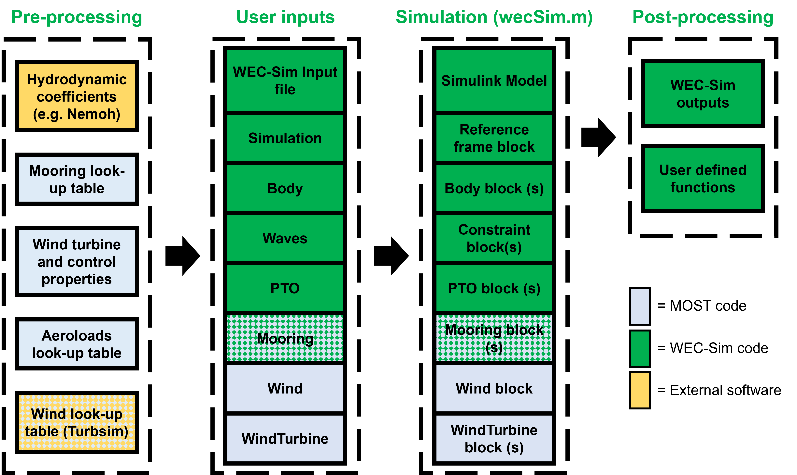

.. _most-introduction:

Introduction
============

With MOST, it is possible to simulate Floating Offshore Wind Turbines (FOWTs) and hybrid platforms thanks to the development of a wind turbine model which can be coupled with the WEC-Sim library. MOST requires several user inputs similar to WEC-Sim including hydrodynamic bodies requiring hydrodynamic coefficients from Boundary Element Method (BEM) software (e.g. Nemoh, Wamit or Ansys Aqwa), mooring, constraints, and simulation input details. Differently to WEC-Sim, MOST also includes user inputs relative to the wind turbine and wind, which will be explained in the next sections.

Numerical codes added to WEC-Sim are the following:

==========================   ============================================================================================================================================================
**File Type**                **File name**                     
Pre-processing Executables   ``mostIO.m``, ``run_turbsim.m``, ``Create_Mooring_Matrix.m``, ``BladeData.m``, ``WTproperties.m``, ``Steady_States.m``, ``Controller.m`` and ``AeroLoads.m``            
Post-Processing Functions    ``userDefinedFunction.m``  
New MATLAB Classes           ``windClass.m`` and ``windTurbineClass.m``  
MOST Simulink Library        ``MOST_Lib.slx``      
==========================   ============================================================================================================================================================

The pre-processing executables and post-processing function can be found in the WEC-Sim Applications MOST example while the new classes and Simulink library have been added to the WEC-Sim source directly.

Existing WEC-Sim source code has also been modified to include further option features relative to the new capabilities. The following codes have been modified:

=========================================      ======================================================================================================================================================================================================================================================================================================================================================
**File name**                                  **Description**                     
``initializeWecSim``                           Modified to add functions relative to the wind, wind turbine, and new mooring blocks. New functions are created in each relative class to read data prepared during the pre-processing by the user. Control parameters are also added to give user choice of which control logic to be used.             
``mooringClass``                               It is now also possible to calculate mooring loads (static loads) using non-linear look-up tables computed during pre-processing and with system displacements as input. Compared to previous versions, the mooringClass now also has a function by means of which look-up tables are loaded from a file whose name is the new property called "lookupTableFile".
``postProcessWecSim`` + ``responseClass``      Modified to add wind turbine results in the WEC-Sim output structure. Examples of new outputs are the timeseries of wind turbine power, rotor speed, blade pitch, and nacelle acceleration.   
=========================================      ======================================================================================================================================================================================================================================================================================================================================================  

The following diagram summarizes the workflow for the simulation of wave energy converters, which has now been updated to include the simulation of floating offshore wind turbines or hybrid devices. The portions of the code introduced with MOST are highlighted in grey, the portions executed by WEC-Sim codes in green, and what is carried out by external software in yellow.

|