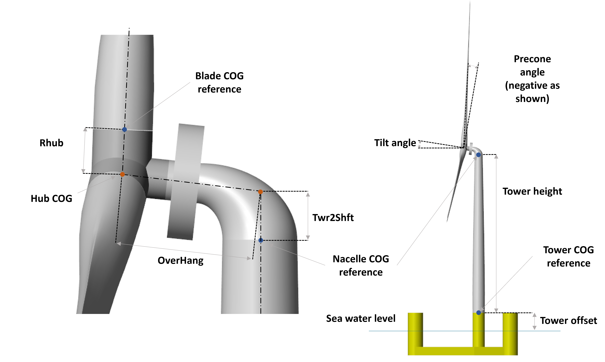
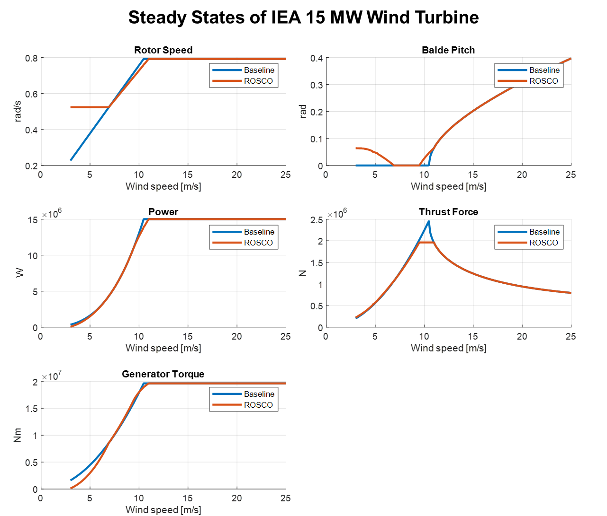
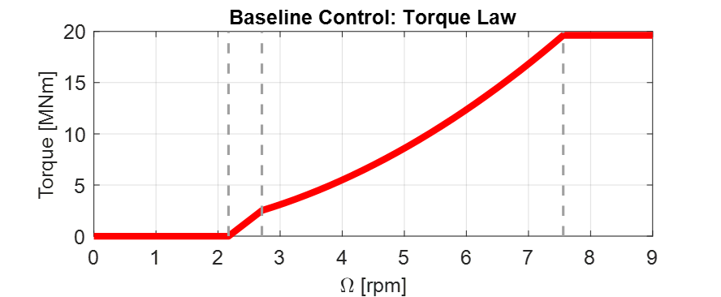
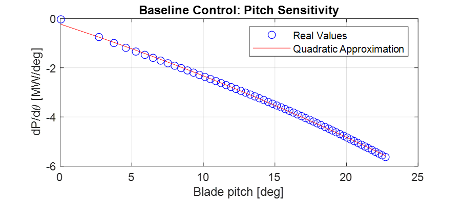
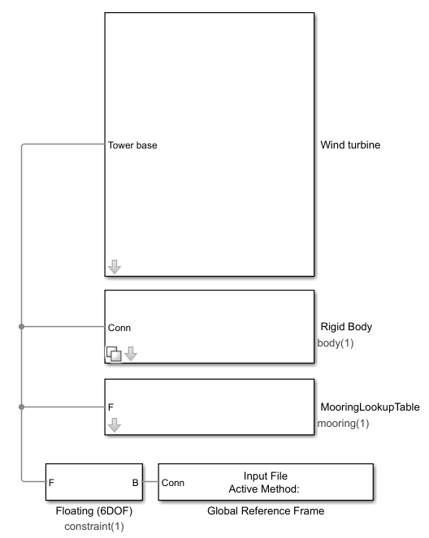
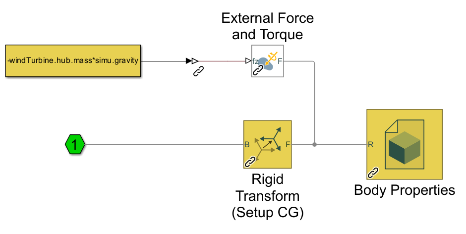
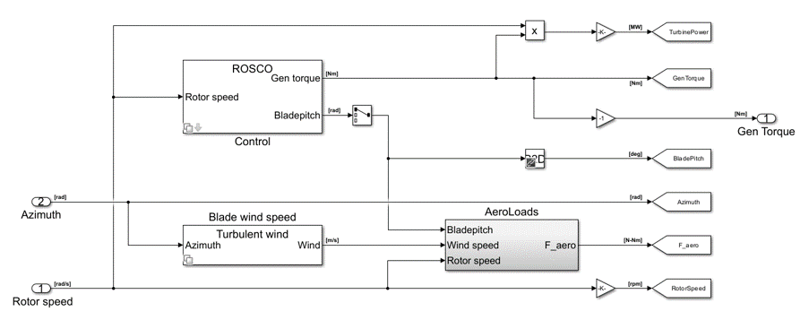

.. _most-theory:

******
Theory
******

In this section, the features introduced with MOST will be explored, offering some theoretical background to understand their use. 
To do this, the workflow shown in the :ref:`most-introduction` will be followed: Pre-processing, User Inputs, Simulation, 
and Post-processing.

Pre-processing
==============
In the pre-processing phase, it is possible to create all the data required for the simulation (except the hydrodynamic coefficients) by 
launching the ``mostIO.m`` script, which will call up other codes, each dedicated to specific data (e.g. wind turbine, control, or mooring) 
and described in this section. As with other WEC-Sim examples, the ``bemio.m`` script should still be used to load the hydrodynamic coefficient data.

Mooring look-up table
---------------------
MOST allows for simulation of a mooring look-up table to model a quasi-static, non-linear mooring system. 
Specifically, the mooring look-up table simulates a mooring system consisting of a certain number of lines suspended between two points 
(anchor and fairlead) and angularly equally spaced. This option is based on the catenary equations similarly to the open-source code MAP++ :cite:`MAP`. 
In the Simulink model, forces and torques due to moorings are determined through 6 different look-up tables having the 6 degrees of freedom surge, 
sway, heave, roll, pitch, and yaw as inputs. The breakpoints (related to the inputs) and the outputs (Fx, Fy, Fz, Mx, My and Mz, i.e., the mooring 
loads) are contained within a data structure called "moor_matrix" and created through the ``Create_Mooring_Matrix.m`` script.

Wind input
----------
This section describes how the input wind field is generated; there are two possible methods: to have constant wind speed (in time and space) or to 
have a wind speed field in which turbulence and non-uniform spatial distribution are taken into account. It is possible to specify wind method in ``wecSimInputFile.m`` by initializing the windClass with "constant" or "turbulent".
In the first case there will be a constant wind speed at all times and at every point on the rotor area, while the second case considers the spatial 
and temporal turbulence of the wind. Regarding the second case, the scatter of the wind speed is obtained using an external code, `Turbsim <https://www.nrel.gov/wind/nwtc/turbsim.html>`_, developed 
by NREL, and integrated within the MOST code. The user can launch the ``run_turbsim.m`` script (in "turbsim" subfolder) to create the wind input data 
structure, specifying some properties such as mean velocity and turbulence intensity. For more information, it is recommended to read the :ref:`most-advanced_features` or the 
documentation of TurbSim :cite:`kelley2005overview`. The resulting data structure consists of the wind speed 
(in the surge direction) at each instant and for each node of a spatial grid covering the rotor area. During the simulation, the wind speed 
corresponding to the blade nodes will be obtained by interpolating between the grid points via look-up tables.

Wind turbine properties
-----------------------
All wind turbine components are modelled as rigid bodies; this includes the tower, the nacelle, the hub, and the blades. The inertial and geometrical
properties of the components must be defined in a MATLAB structure, the user can use the script ``WTproperties.m`` ("turbine_properties" subfolder) to write the parameters of the 
desired wind turbine. In particular, mass, moment of inertia, centre of mass relative to the reference, and centre of mass in the global reference 
frame (whose origin is at the sea water level) are defined for each body. In addition, other parameters such as tilt and precone angles, tower 
height, electrical generator efficiency, and CAD file names are set. The CAD files to define the geometry can be imported from external software. 
They must be saved in the folder "geometry". The user must set the name of the CAD files in "WTcomponents" struct to allow MOST to upload the files.

   
|
   
In addition to the general characteristics of the wind turbine, the user must set the specific properties for the blades by launching the ``BladeData.m`` 
script, which defines the needed data structure by taking the information from some text files in the "BladeData" subfolder. In these, lift, drag, and 
torque coefficients are specified for each type of airfoil used, as well as certain geometric characteristics of the blades such as twist angle and 
chord length as a function of radius and geometric characteristics related to pre-bending.

Control properties
------------------

This section explains how the MOST controller characteristics to be used in simulations are calculated. As mentioned earlier, it is possible to choose
between two control logics (Baseline :cite:`Hansen2005` and ROSCO :cite:`abbas2022reference`), and, for the creation of the data required for the 
simulation, it is necessary to know the steady-states values, i.e. the stationary values of certain quantities of interest when varying, in this case, 
the wind speed, which is considered constant for this purpose. The first step in obtaining the data required for the simulation is therefore to run 
the script called ``Steady_States.m`` in the subfolder "control" to perform this calculation. Specifically, through this, the stationary values 
of power, rotor speed, thrust force, generator torque, and blade pitch angle are computed for both of the aforementioned control logics. 
The script calculates different stationary values according to the control logic because of their diversity. Specifically, only the ROSCO controller 
imposes an upper limit for the thrust force, so when the wind speed is close to the nominal wind speed (where the force peak occurs), the blade pitch
value will be slightly higher to reduce the thrust and comply with the imposed limits. The second difference is that in the Baseline controller, no 
minimum rotor speed is imposed, which is the case for some turbine types in the ROSCO case. 

Below is a figure representing an example of steady-state values for Baseline and ROSCO controllers for the IEA 15 MW reference wind turbine :cite:`Gaertner2020`. 

|
   
In the following, the Baseline and ROSCO control logics will be briefly explained; for more information refer to  :cite:`Hansen2005` (Baseline) 
and :cite:`abbas2022reference` (ROSCO).

.. _Baseline:

Baseline 
^^^^^^^^

Baseline is a conventional, variable-speed, variable collective pitch controller, which is made up of two independent systems:

* A generator torque controller (consisting of a generator speed-torque law) designed to maximize power extraction below nominal wind speed
* A blades collective pitch controller designed to regulate rotor and generator speed above nominal wind speed

Generator torque controller
"""""""""""""""""""""""""""

The generator-torque control law is designed to have three main regions and two transition ones between them. Aerodynamic torque acts as an 
accelerating load, the generator torque, converting mechanical energy to electrical energy, acts as a braking load. The generator torque is computed 
as a tabulated function of the filtered generator speed, incorporating 4 operational control regions: 1, 1.5, 2, and 3.

* **Region 1**: control region before cut-in wind speed, where the generator is detached from the rotor to allow the wind to accelerate the rotor for start-up. In this region, the generator torque is zero and no power is extracted from the wind.

* **Region 1.5**: transition region called start-up region and permits a smooth transition between null and optimal torque.

* **Region 2**: control region where extracted power is maximized. Here, to maintain the tip speed ratio constant at its optimal value, the generator torque is proportional to the square of the filtered generator speed. Aerodynamic torque can be expressed as: 

  .. math::
     T_{\text {aero }}=\frac{1}{2} \rho \pi \frac{R^5}{\lambda^3} C_P\left(\lambda, \theta_{\text {bl }}\right) \cdot \Omega^2=k_{\text {opt }} \cdot \Omega^2\ \ \ \ \ \ (1)
  
  Where :math:`k_{opt}` is obtained with TSR (Tip Speed Ratio, :math:`λ`) and blade pitch values that lead to maximum power coefficient: :math:`λ = λ_{opt}`, :math:`\theta_{bl} = 0^{\circ}`;

* **Region 3**: above rated condition region, where the generator torque is kept constant at its rated value. In this region pitch control is active to maintain rotor speed at its rated value.

The figure below shows an example of control law of the Baseline generator torque controller for the IEA 15 MW reference wind turbine :cite:`Gaertner2020`. 

|
   
Blade pitch controller
""""""""""""""""""""""

Regarding the blade pitch controller, it regulates the generator speed in region 3 (where wind speed exceeds its rated value) to maintain it at its nominal 
value through a scheduled proportional-integral control (PI). In this region the torque is kept constant at its rated value (:math:`T_{gen} = T_{gen,r} = P_{r} / \Omega_{r}`). 
Aerodynamic torque :math:`T_{\mathrm{aero\ }}` depends on wind speed, rotor speed and blade pitch, but assuming in this region rotor speed maintains 
its rated value :math:`\Omega_r` (this assumption can be made since the control objective is to track that value) and neglecting power to 
wind speed sensitivity, linearization around rated condition is:

.. math::

    T_{\text {aero }} \approx T_{\text {aero }}\left(U_{\text {wind}, r}, \Omega_r, \theta_{b l, r}\right)+\left.\frac{d T_{\text {aero }}\left(U_{\text {wind }}, \Omega, \theta_{b l}\right)}{d \theta_{b l}}\right|_{\substack{U_{\text {wind }}=U_{\text {wind}, r} \\ \Omega=\Omega_r}}\left(\theta_{b l}-\theta_{b l, r}\right)=

    =\frac{P\left(U_{\text {wind}, r}, \Omega_r, \theta_{b l, r}\right)}{\Omega_r}+\left.\frac{1}{\Omega_r} \frac{d P\left(U_{\text {wind}}, \Omega, \theta_{b l}\right)}{d \theta_{b l}}\right|_{\begin{array}{c} \theta_{\text {wind }}=U_{\text {wind}, r} \\ \Omega=\Omega_r \end{array}}\left(\theta_{b l}-\theta_{b l, r}\right)\ \ \ \ \ \ (2)

where :math:`U_{wind,r}` and :math:`\theta_{bl,r}` are rated wind speed and blade pitch. Once first is chosen, :math:`\theta_{bl,r}` is which one leads to a steady state 
condition with extracted power equal to the rated one. So, aerodynamic torque expression becomes:

.. math::

    T_{\mathrm{aero\ }}\approx\ \frac{P_r}{\Omega_r}+\frac{1}{\Omega_r}\frac{dP}{d\theta_{bl}}\Delta\theta_{bl}\ \ \ \ \ \ (3)     

Where :math:`\Delta \theta _{bl}` represents a small perturbation of the blade pitch angle about its linearization point :math:`\theta_{bl,r}`. By 
expressing the blade-pitch regulation starting from the speed perturbation with a proportional-integrative control law (PI), it is possible to write:

.. math::

   \Delta \theta_{b l}=K_P \Delta \Omega+K_I \int_0^t \Delta \Omega d t\ \ \ (4)  

Where :math:`K_P` is the proportional gain and :math:`K_I` the integrative gain; :math:`\Delta\Omega` represents a small perturbation of rotor speed about its rated value: 
:math:`\Delta\Omega=\ (\Omega-\Omega_r)`. Combining last equations found with the equilibrium equation of the rotor around its rotation axis
:math:`(T_{\mathrm{aero\ }}-\ T_{\mathrm{gen\ }}=  I_{\mathrm{eq\ }}\dot{\Omega})`, it is possible to obtain, once defined :math:`\Delta\Omega=\ \dot{\delta}`, 
the following relation:

.. math::
   \frac{P_r}{\Omega_r}+\frac{1}{\Omega_r} \frac{d P}{d \theta_{b l}}\left(K_P \dot{\delta}+K_I \delta\right)-\frac{P_r}{\Omega_r}=I_{e q} \ddot{\delta}\ \ \ (5)

Which can be rearranged as:

.. math::
   I_{e q} \ddot{\delta}+\left[-\frac{d P}{d \theta_{b l}} \frac{K_P}{\Omega_r}\right] \dot{\delta}+\left[-\frac{d P}{d \theta_{b l}} \frac{K_I}{\Omega_r}\right] \delta=0\ \ \ (6)

That in the canonical form becomes:

.. math::
   M \ddot{\delta}+C \dot{\delta}+K \delta=0 \ \ \ \ (7)

With:   :math:`\ M= I_{eq}`,   :math:`\\C= \left[-\frac{dP}{d\theta_{bl}}\frac{K_P}{\Omega_r}\right]`,   :math:`\\K=\left[-\frac{dP}{d\theta_{bl}}\frac{K_I}{\Omega_r}\right]`

Now it is possible to choose proportional and integral gains in order to obtain desired characteristics of the blade pitch control. Its characteristics 
directly depend on natural frequency and damping ratio: 

.. math::
   \omega_n=\sqrt{\frac{M}{K}}\ \ ,\ \ \ \ \ \ \zeta=\frac{C}{2M\omega_{n\ }}\ \ \ \ \ \ (8)

Once defined :math:`\omega_{n}` and :math:`\zeta`, expressions of proportional and integral gains become:

.. math::
    K_P=\frac{2\ I_{eq}{\ \omega}_n\ \zeta{\ \Omega}_r}{-\ \frac{dP}{d\theta_{bl}}}=\ \frac{K_P^\prime}{\frac{dP}{d\theta_{bl}}}\ ,\ \ \ \ \ \ \ K_I=\frac{I_{eq\ }\omega_n^2{\ \Omega}_r}{-\ \frac{dP}{d\theta_{bl}}}=\ \frac{K_I^\prime}{\frac{dP}{d\theta_{bl}}}\ \ \ \ \ \ \ \ \ \ (9)

The term :math:`\frac{dP}{d\theta_{bl}}` is the power to pitch sensitivity, which depends on wind speed and blade pitch (related each other as previously 
mentioned) adopted during linearization. So, to always have the same system characteristic (:math:`\omega_n` and :math:`\zeta`), proportional and integral 
gains must vary with a variation of blade pitch and so of wind speed. Figure below shows power to pitch sensitivity with respect to blade pitch; as can be 
seen there, it can be well approximated with a quadratic regression, through which quadratic form that minimize sum of square error is computed. Thanks to 
this regression, power to pitch sensitivity expression becomes of the form:

.. math::
   \frac{dP}{d\theta_{bl}}\ \approx\ c_1{\theta_{bl}}^2+c_2\theta_{bl}+c_3\ \ \ \ \ \ (10)
   
:math:`\frac{dP}{d\theta_{bl}}` is the power to pitch sensitivity and :math:`c_1 (W/{deg}^3)`, :math:`c_2 (W/{deg}^2)` and :math:`c_3 (W/deg)` are the 
coefficients of its quadratic regression.

 
|
   
This approximation will make the calculation of controller gains computationally less demanding during simulation.

.. _ROSCO:

ROSCO 
^^^^^
ROSCO controller (Reference Open-Source COntroller for fixed and floating offshore wind turbines) was developed by researchers at the Delft University
of Technology :cite:`abbas2022reference` to provide a modular reference wind turbines controller that represent industry standards and performs comparably 
or better than existing reference controllers, such as baseline, discussed in previous section. The primary functions of the controller are still to 
maximize power in below-rated operations and to regulate rotor speed in above-rated ones, moreover, it also provides additional modules which can improve 
control performances. ROSCO controller, as well as Baseline and most of other conventional ones, consists of two methods of actuation: generator torque 
and collective blade pitch. Strategies of actuation are commonly separated into four main regions, with transition logic between them. Regions 1 and 4 
correspond to below cut-in and above cut-out wind speed conditions, these regions are generally out of interest for standard control purposes (performances 
optimization) and so they will not be further discussed below. In region 1 generator torque is set to zero to allow the wind to accelerate the rotor for 
start-up. In this region, no power is extracted. In region 4 blades are pitched to reduce thrust force to zero (feathering position).

.. image:: IMAGE_ROSCO_Power_Curve.png
   :width: 60%
   :align: center

|
   
Control strategies for regions 1.5, 2 and 3 are highly like those ones adopted in Baseline control. Region 2 is when wind speed is below rated condition, 
here main goal is power extraction maximization. To do so, two methods can be used, a quadratic law (as in Baseline controller) of generator torque with 
respect to rotor angular speed or a tip speed ratio (TSR) tracking to maintain the latter at its optimal value (in this case a wind speed estimation is needed). 
Region 3 is when wind speed is above rated condition, here blade pitch is regulated to maintain rotor speed at its rated value and to stabilize platform (for 
offshore floating wind turbines, through floating feedback module), while generator torque is kept constant at its rated value. Region 1.5 is a transition 
region from cut-in wind speed and region 2. Here generator torque is regulated to maintain a defined minimum rotor speed and blades are pitched to compensate 
resulting high values of TSR to improve power extraction. 

ROSCO Implementation
""""""""""""""""""""
Controller implementation starts from aerodynamic torque (:math:`T_{aero}`) expression and rotor equilibrium equation:

.. math::
   T_{aero}=\frac{1}{2}\ \rho\ A_D\ C_P\ (\lambda,\theta_{bl})\ \frac{{U_\infty}^3\ }{\Omega}\ \ \ \ \ \ (11) 

.. math::   
   \dot{\Omega}=\frac{T_{\mathrm{aero\ }}-\ T_{gen}\ }{I_{\mathrm{eq\ }}}\ \ \ \ \ \ (12)

:math:`I_{\mathrm{eq\ }}` is the rotor inertia, :math:`\rho` is the air density, :math:`A_D` is the rotor area, :math:`C_P` is the power coefficient 
and :math:`U_\infty` is the undisturbed wind speed. The first-order linearization of eq 11 at some nominal steady-state operational point is:

.. math::
   \Delta T_{aero}=\Gamma_\Omega\left|\begin{matrix}\ \\op\\\end{matrix}\right.\ \Delta\Omega+\Gamma_{\theta_{bl}}\left|\begin{matrix}\ \\op\ \\\end{matrix}\right.\Delta\theta_{bl}+\Gamma_U\left|\begin{matrix}\ \\op\ \\\end{matrix}\right.\Delta U\ \ \ \ \ \ (13)  

With:  :math:`\ \ \ \Gamma_\Omega\left|\begin{matrix}\ \\op\\\end{matrix}\right.=\partial T_{aero}/\partial\Omega\ \left|\begin{matrix}\ \\op\\\end{matrix}\right.,{\ \ \ \ \ \Gamma}_{\theta_{bl}}\left|\begin{matrix}\ \\op\\\end{matrix}\right.=\partial T_{aero}/\partial\theta_{bl}\ \left|\begin{matrix}\ \\op\\\end{matrix}\right.\mathrm{,\ \ \ \ \ \ \ }\Gamma_U\left|\begin{matrix}\ \\op\\\end{matrix}\right.=\partial T_{aero}/\partial U\ \left|\begin{matrix}\ \\op\\\end{matrix}\right.`

“op” denotes the steady-state operational point at which linearization is made. Equation 12 can then be rewritten as (Δ denotes the perturbation from 
steady state value “op” and :math:`\left \{ X_{op}=\lambda_{op},\\\ \theta_{bl, op} \right \}`):

.. math::
   \Delta \dot{\Omega}=A\left(\boldsymbol{X}_{\mathrm{op}}\right) \Delta \Omega+B_{T_{g e n}} \Delta T_{g e n}+B_{\theta_{b l}}\left(\boldsymbol{X}_{\mathrm{op}}\right) \Delta \theta_{b l}+B_U\left(\boldsymbol{X}_{\mathrm{op}}\right) \Delta U\ \ \ \ \ \ (14)

With: 

.. math::
 
   A\left(\boldsymbol{X}_{\mathrm{op}}\right)=\frac{1}{I_{\mathrm{eq}}} \frac{\partial T_{\text {aero }}}{\partial \lambda} \frac{\partial \lambda}{\partial \Omega} \\

.. math::
   \frac{\partial T_{\text {aero }}}{\partial \lambda}=\frac{1}{2} \rho A_{\mathrm{D}} R U_{\mathrm{op}}^2 \frac{1}{\lambda_{\mathrm{op}}^2}\left(\frac{\partial C_{\mathrm{p}}}{\partial \lambda} \lambda_{\mathrm{op}}-C_{\mathrm{p}, \mathrm{op}}\right) \\

.. math::
   \frac{\partial \lambda}{\partial \Omega}=\frac{R}{U_{\mathrm{op}}}, \quad\left(\lambda=\frac{\Omega R}{U}\right) \\

.. math::
   B_{T_{g e n}}=-\frac{1}{I_{\mathrm{eq}}} \\

.. math::
   B_{\theta_{b l}}\left(\boldsymbol{X}_{\mathrm{op}}\right)=\frac{1}{2 I_{\mathrm{eq}}} \rho A_{\mathrm{D}} R U_{\mathrm{op}}{ }^2 \frac{1}{\lambda_{\mathrm{op}}^2}\left(\frac{\partial C_{\mathrm{p}}}{\partial \theta_{b l}} \lambda_{\mathrm{op}}\right)

All derivatives are calculated at “op” conditions; :math:`\Delta U`, difference between actual wind speed and wind speed at linearization point, is considered 
equal to zero during control tuning, that is computation of control gains. Both generator torque and blade pitch controllers are PI controllers, generically 
defined as:

.. math::
   y = K_P \ u + K_I \int_{0}^{T} u\ dt\ \ \ \ \ \ (15) 

Where :math:`u` represents the input and :math:`y` the output, while :math:`K_P` and :math:`K_I` are respectively the proportional and integral gains. Generator torque 
controller has as input and output:

.. math::
   u=-\delta\Omega\ ,\ \ \ y=\Delta C_{gen}\ \ \ \ \ \ (16) 

Blade pitch controller has as input and output:

.. math::
   u=-\delta\Omega,\ \ \ y=\Delta\theta_{bl}\ \ \ \ \ \ (17)
   
:math:`\delta\Omega` is defined as a perturbation from the reference speed:

.. math::
   \Omega(t)=\Omega_{\mathrm{ref\ }}+\delta\Omega\longrightarrow-\delta\Omega=\Omega_{ref}-\Omega(t)\ \ \ \ \ \ (18)

While :math:`\Delta C_{gen}` and :math:`\Delta\theta_{bl}` are perturbations from steady state values:

.. math::
   \theta_{bl}(t)={\theta_{bl}}_{\mathrm{op\ }}+\Delta\theta_{bl},{\ \ \ \ C}_{gen}(t)={C_{gen}}_{op}+\Delta C_{gen}\ \ \ \ \ \ (19)

Now, defining :math:`\Delta \Omega_{ref} =\Omega_{ref}-\Omega_{op}` (assumed =0, since “op” point is chosen at a steady state condition with 
:math:`\Omega_{op}=\Omega_{ref}`), we can combine equation 14 with above definitions to obtain a differential equation that relates 
:math:`\Delta \Omega =\Omega-\Omega_{op}` and :math:`\Delta \Omega_{ref}`. Then, if the Laplace transform of this equation is considered, we arrive 
to two closed-loop transfer functions (one for the generator torque module and the other for the blade pitch one) in the form:

.. math::
   H(s)=\frac{\Delta \Omega(s)}{\Delta \Omega_{\mathrm{ref}}(s)}=\frac{B\left(K_P\left(x_{\mathrm{op}}\right) s+K_I\left(x_{\mathrm{op}}\right)\right)}{s^2+\left(B K_P\left(x_{\mathrm{op}}\right)-A\left(x_{\mathrm{op}}\right)\right) s+B K_I\left(x_{\mathrm{op}}\right)}\ \ \ \ \ \ (20)

Where :math:`B` is :math:`B_{T_{gen}}` or :math:`B_{\theta_{bl}}`, depending on which module is considered, since when generator torque loop is 
considered, :math:`\Delta\theta_{bl}` is set to zero and, when blade pitch loop is considered, :math:`\Delta T_{gen}` can be equal to zero or 
:math:`B_{T_{gen}}` can be englobed in :math:`A`. Moreover, in both cases we consider :math:`\Delta U=0`. :math:`H(s)` is a simple second order 
system whose characteristics are strictly related to natural frequency and damping ratio of its canonical form. They can be defined, in order to 
reach desired performance, choosing values of proportional and integral gains. If we call :math:`\omega_n` the natural frequency and :math:`\zeta` 
the damping ratio, :math:`K_P` and :math:`K_I` expressions (varying with operational steady state point) are:

.. math::

   K_P=\frac{1}{B\left(\boldsymbol{x}_{\mathrm{op}}\right)}\left(2 \zeta \omega_n+A\left(\boldsymbol{X}_{\mathrm{op}}\right)\right)\ \ \ \ \ \ (21)

.. math::   

   K_I=\frac{\omega_{\mathrm{n}}^2}{B\left(\boldsymbol{X}_{\mathrm{op}}\right)}\ \ \ \ \ \ (22)
   

Once transfer function of generator torque and blade pitch closed loop has been defined, and once way through which PI controllers’ gains are computed 
has been explored, we can focus, specifically, on the two different modules to investigate the reference speed signals adopted and how the scheduling 
of gains is performed, varying according to the conditions in which the system is.

Generator Torque Controller
"""""""""""""""""""""""""""
Four different generator torque controllers are available in ROSCO, they are the possible combination between two methods for below wind speed operations 
and two methods for above wind speed conditions. Regarding below rated operations, to maximize extracted power at each wind condition, a quadratic low 
of generator torque with respect to rotor angular speed can be adopted. In this section we omit exploitation of this method since is the same adopted 
in Baseline controller. Alternatively, a tip speed ratio tracking to maintain it at its optimal value can be adopted. If the wind speed can be measured 
or estimated accurately, a generator torque controller can be designed to maintain the :math:`\lambda_{opt}` and maximize power capture, so reference 
rotor angular speed becomes:

.. math::
   {\Omega_{ref}}_\tau=\frac{\lambda_{opt}\ \hat{U}}{R}\ \ \ \ \ \ (23)

Where subscript :math:`\tau` indicates the reference speed of torque controller and :math:`\hat{U}` is the estimated wind speed. From equations 14, 21 
and 22, it can be seen that integral gain :math:`K_I` of generator torque controller is constant, whereas :math:`A`, so proportional gain :math:`K_P`, 
are both dependent on :math:`U` (wind speed). However, it was found that fixing :math:`K_P = K_P (U = Urated)` does not negatively affect power production.
Regarding the two existing methods for above rated conditions, first of them considers a constant generator torque, defined as:

.. math::
   T_{gen,ar}(t)=\ T_{rated}=\frac{P_{\mathrm{rated\ }}}{\Omega_{rated}}\ \ \ \ \ \ (24)

Where subscript “ar” means “above rated”. On the other hand, the second strategy considers a constant extracted power equal to its rated value, so 
generator torque is defined as:

.. math::
   T_{gen,ar}(t)=\frac{P_{\mathrm{rated\ }}}{\Omega}\ \ \ \ \ \ (25)

Blade Pitch Controller
""""""""""""""""""""""
Main goal of blade pitch controller is keeping rotor angular speed at its rated value, so reference speed is (both in below rated and above rated 
conditions):

.. math::
   \Omega_{\mathrm{ref\ },\theta_{bl}}=\Omega_{\mathrm{rated}}\ \ \ \ \ \ (26)

Where subscript :math:`\theta_{bl}` means we refer to blade pitch controller. In below rated conditions, generator speed is lower than rated value, 
so :math:`-\delta\Omega=\Omega_{ref}-\Omega\ >\ 0` and, since gains are normally negative, :math:`\theta_{bl}` is saturated at its minimum value, 
defined by an additional module of ROSCO controller which will be discussed later. According to equations 21 and 22, to find controllers gain values, 
:math:`B_{\theta_{bl}}\left({X}_{op}\right)` and :math:`A\left({X}_{op}\right)` should be computed. They change for any operation point at which 
system is linearized, so they are function of :math:`{X}_{op}=\ \left\{\lambda_{op},{\theta_{bl}}_{op}\right\}`. Linearization point can be the 
optimal steady state values chosen during strategy definition, for which there is a unique relationship between :math:`\lambda_{op}` and 
:math:`{\theta_{bl}}_{op}`. For this reason, :math:`B_{\theta_{bl}}` and :math:`A` can be expressed with respect to :math:`{\theta_{bl}}_{op}`, 
so gains’ values can be scheduled with :math:`\theta_{bl}`  as parameter.

Additional Control Modules
""""""""""""""""""""""""""
In this section principal additional modules are briefly discussed to understand their functions and how they modify control output; for more information 
it is possible to consult :cite:`abbas2022reference`. They are:

* **Wind speed estimator** : This module estimates wind sped used for TSR tracking in the generator torque controller. Employed algorithm is based on a continuous-discrete Kalman filter, which exploits system model, a wind auto regressive model and other information, like covariance matrices based on the expected wind field and measure’s confidence of rotor speed to estimate a mean wind speed across rotor area at each time.

* **Set Point Smoothing** : Generator torque and blade pitch controllers will normally conflict with each other in near-rated operation due to incompatible reference rotor speed. To avoid this, a set point smoother can be employed; it shifts the speed reference signal of the inactive controller while the active one works. As an example, at above rated condition torque controller is the inactive one and vice versa. If TSR tracking were to be adopted for the torque generator, then the reference speed at high wind speeds would be higher than the one actually wanted (rated one), so the smoother brings the reference towards the rated speed and the resulting torque approaches the rated one, the one actually intended by adopting a constant torque strategy under above conditions.

* **Minimum pitch Saturation** : This module defines a minimum value of blade pitch angle which will be used as a saturation limit during control operations. It mainly modifies expected blade pitch values in region 1.5 and near rated conditions and leads to two effects:

    * **Peak shaving** : Near rated condition thrust value reaches the highest values, since below rated wind speed is lower and above rated condition blade pitching reduces that force. So, to limit loads, minimum pitch module imposes not null pitch angles also below rated wind speed, near that value.
    
    
    * **Power maximization in low wind** : In region 1.5, as mentioned in control region section, a minimum value of rotor speed is imposed, so at low wind speeds TSR deviates far from its optimal value. To compensate this fact and to increase power coefficient value in this condition, blade pitch is led to be greater.

* **Floating offshore wind turbine feedback** : this module is though for FOWTs (Floating Offshore Wind Turbines) and introduces a new term in the PI blade pitch controller, which becomes:

    .. math::
	\Delta \theta_{b l}=-k_{\mathrm{P}} \delta \Omega-k_{\mathrm{I}} \int_0^T \delta \Omega \mathrm{d} t+k_{\theta_{\text {bl,float }}} \dot{x}_t\ \ \ \ \ \ (27)

  Additional term is tower-top velocity :math:`{\dot{x}}_t` multiplied by :math:`k_{{\theta_{bl,float}}_\mathrm{\ }}` gain. The latter is chosen from a 
  manipulation of rotor equilibrium equation and structure pitch equation, in which expression of thrust and power coefficients compare. The aim is to 
  find gains’ value that reduces rotor angular acceleration to tower speed sensitivity to mitigate structure pitch effect on rotor aerodynamic torque. 
  This expedient increases the average extracted power and stabilizes the structure.

|

In this case, TSR tracking was chosen for torque control at wind speeds lower than nominal one and a constant torque equal to nominal in above rated 
conditions. Furthermore, the wind speed is assumed to be a priori known, so the Kalmann filter constituting the estimation module will not be 
exploited. 

Aerodynamic Loads
-----------------

The aerodynamic loads due to the interaction between wind and blades are determined during the simulation using look-up tables previously obtained 
during pre-processing. Specifically, the "AeroLoads" script in the "aeroloads" subfolder handles this by using a function, based on BEM (Blade Element 
Momentum Theory), which receives as input the wind speed, rotor speed, and blade pitch angle and outputs the aerodynamic forces and torques acting on 
the blade root. For more information on the resolution of BEMT see :cite:`ning2014simple` and :cite:`Ning2015`. The aerodynamic forces do not take into 
account the flexibility of the blade (rigid body assumption), the deflection of the wake due to the rotor misalignment with respect to the wind and 
the wake dynamics. The domain of the tables will consist of the wind speeds for which the stationary values were previously calculated and a number 
of values of rotor speed and blade pitch angle evenly spaced around the stationary value corresponding to the wind speed. The look-up table of 
the aerodynamic loads has only one input for the wind speed, so the average wind speed is determined by interpolating four points for each blade in 
the wind grid along the blade length. The discretization points are defined by “blade.bladeDiscr” in ``WTproperties.m`` script. It is preferable to define 
those points starting from the middle of the blade and not from the root because the wind speed has more influence at the final section of the blade. The horizontal hub speed, due to surge and pitch oscillation, is added to the wind speed. 
Furthermore, the pitch motion and yaw motion of the hub multiplied by the distance from the hub of discretization points (blade.bladeDiscr) are also 
added to wind speed.

User inputs
===========

In addition to the settings defined in pre-processing, to use MOST it is necessary to define simulation settings and decide which input files (created 
in the pre-processing) to use, this is done via the WEC-Sim library script ``wecSimInputFile.m``. 

Simulation
==========

The simulation of floating wind turbines or hybrid systems is carried out in the Simulink environment using the WEC-Sim libraries and the MOST library 
("MOST_lib.slx"), for the wind turbine part and its control. In order to launch the simulation, it is necessary to use the ``wecSim.m`` executable, 
which calls up ``wecSimInputFile.m`` for defining the input data and the ``initializeWecSim.m`` function for setting up the classes and defining the active 
variant subsystems according to the settings made. Below is an example of a Simulink model for the simulation of a floating wind turbine.

   
|  
   
The platform and mooring subsystems are libraries of WEC-Sim that solve the hydrodynamic and hydrostatic loads acting on the platform and the forces 
due to moorings according to the settings and file names provided. The turbine subsystem is the MOST library, visible in the figure below.

.. image:: IMAGE_MOST_Library.png
   :width: 100%
   :align: center

|
   
The MOST model is mainly composed of rigid bodies (representing the various components of the turbine) connected via fixed joints or, in the case of 
the link between the hub and nacelle, with a revolute joint. An example of a component (hub) can be seen in the figure below and includes the calculation of 
inertial forces (in the "Body Properties" block) and weight force (in the "External Force and Torque" block). In the case of blades, aerodynamic forces 
are also applied via a similar block. 

|
   
In the 'Aerodynamics + Control' subsystem, the aerodynamic forces and torque values of the generator and collective blade pitch are derived. In the 
"Control" and "Blade wind speed" subsystems, variant subsystems are contained in which it is decided whether to use the Baseline or ROSCO controller 
and whether to have constant or turbulent wind. With regard to wind block, here the relative speed with respect to the interested blade nodes is 
calculated, receiving the movements of the structure and the wind field as inputs. Finally, the "AeroLoads" subsystem contains the look-up tables of 
the aerodynamic loads obtained in pre-processing.

|
   
   
Post-processing
===============

Post-processing consists of processing the simulation output data and saving it, as well as of the possible creation of an (ASCII) text file containing 
the simulation report. For this we rely on the WEC-Sim executables ``stopWecSim.m`` and ``postProcessWecSim.m``, which use the ``rensponseClass`` for processing 
the results, and on the ``userDefinedFunction.m`` script to plot time-domain simulation input and output by also exploiting some functions of the ``rensponseClass``.
The ``responseClass`` contains all the output time-series and methods to plot and interact with the results. It is not initialized by the user; instead, it 
is created automatically at the end of a WEC-Sim simulation. The ``responseClass`` does not input any parameter back to WEC-Sim, only taking output data from 
the various objects and blocks. After WEC-Sim is done running, there will be a new variable called ``output`` saved to the MATLAB workspace.   
The output object is an instance of the ``responseClass``; it contains all the relevant time-series results of the simulation.
The figure below shows an example of some input-output plots from a simulation of the IEA 15 MW reference wind turbine mounted on the VolturnUS semi-submersible 
platform (:cite:`Gaertner2020` and :cite:`Allen2020`).

.. image:: IMAGE_Results_Plots_example.png
   :width: 100%
   :align: center

