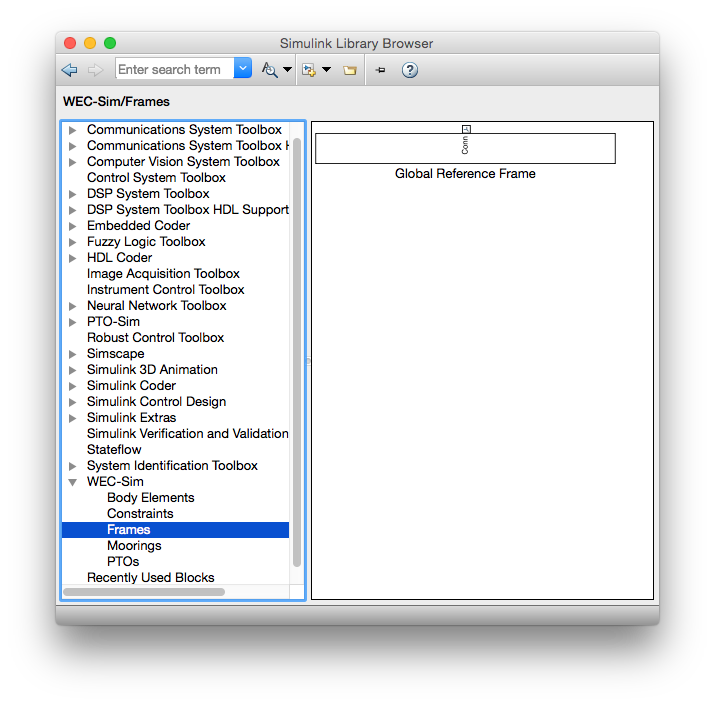
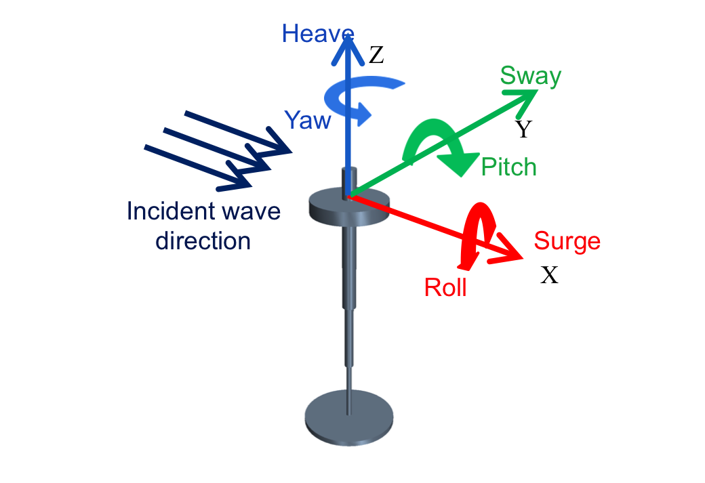

.. _code_structure:

Code Structure
==============
This section provides a description of the WEC-Sim source code and its structure. 
The WEC-Sim source code consists of a series of MATLAB ``*.m`` objects (defined in WEC-Sim as classes) and Simulink ``*.slx`` library blocks which are executed by the ``wecSim.m`` script. Executing ``wecSim.m`` parses the user input data, performs preprocessing calculations in each of the classes, selects and initializes variant subsystems in the Simulink model, and runs the time-domain simulations in WEC-Sim. 

=========================   ================  ====================
**File Type**               **File name**     **Directory**
WEC-Sim Executable Script   wecSim.m          ``$Source``
WEC-Sim MATLAB Objects      <object>Class.m   ``$Source/objects``
WEC-Sim Simulink Libary     <block>_Lib.slx   ``$Source/lib``
=========================   ================  ====================

Input File 
------------
A WEC-Sim input file (``wecSimInputFile.m``) is required for each run. 
The input file must be named ``wecSimInputFile.m`` and must be placed within the case directory. 
The main structure of the input file consists of initializing all the objects necessary to run WEC-Sim simulations, and defining any user specified properties for each object.
The input file for each WEC-Sim simulation requires initialization and definition of the simulation and wave classes, at least one instance of the body class, and at least one instance of the constraint or PTO classes.
For details about WEC-Sim's objects and available properties for each object, refer to the `WEC-Sim Objects Section <http://wec-sim.github.io/WEC-Sim/code_structure.html#wec-sim-objects>`_.

An example WEC-Sim input file is shown below for the OSWEC Tutorial - addtional examples are provided in the `Tutorials Section <http://wec-sim.github.io/WEC-Sim/tutorials.html>`_, and are also provided in the WEC-Sim source code tutorials folder.
WEC-Sim is an object oriented code and the input file reflects this.
The WEC-Sim input file (``wecSimInputFile.m``) for the OSWEC intializes and specifies properties for simulation, body, constraint and pto classes.

*wecSimInputFile.m for OSWEC*

.. literalinclude:: OSWECwecSimInputFile.m
   :language: matlab

WEC-Sim Objects
----------------
All information required to run WEC-Sim simulations is contained within the ``simu``, ``waves``, ``body(i)``, ``pto(i)``, ``constraint(i)``, and ``mooring(i)`` objects (instances of the simulationClass, waveClass, bodyClass, constraintClass, ptoClass, and mooringClass).  
The user can interact with these classes within the WEC-Sim input file (``wecSimInputFile.m``). 
The remainder of this section describes the role of the WEC-Sim objects, and how to interact with the WEC-Sim objects to define input properties. 

There are two ways to look atthe available properties and methods within a class.
The first is to type ``doc className`` in Matlab Command Window, and the second is to open the class definitions located in the ``//WEC-Sim/source/objects`` directory by typing ``open className`` in MATLAB Command Window.
The latter provides more information since it also defines the different fields in a structure.

Simulation Class
~~~~~~~~~~~~~~~~~
The simulation class file, ``simulationClass.m``, is located in the ``//WEC-Sim/source/objects`` directory. 
The simulation class contains the simulation parameters and solver settings necessary to execute the WEC-Sim code. 
Within the ``wecSimInputFile.m``, users must initalize the simulation class (``simulationClass``) and specify the name of the  WEC-Sim (``*.slx``) model file by including the following lines::

	simu=simulationClass();
	simu.simMechanicsFile='<WEC Model Name>.slx'
	
	
Users may specify other simulation class properties using the ``simu`` object in the ``wecSimInputFile.m``, such as: simulation start time (``simu.startTime``), end time (``simu.endTime``), ramp time (``simu.rampTime``) and time step (``simu.dt``). 
All simulation class properties are specified as variables within the ``simu`` object as members of the ``simulationClass``.

The WEC-Sim code has default values defined for the simulation class properties. 
These default values can be overwritten by the user, for example, the end time of a simulation can be set by entering the following command: ``simu.endTime = <user specified end time>``.

Available simulation properties, default values, and functions can be found by typing ``doc simulationClass`` in the MATLAB command window, or by opening the ``simulationClass.m`` file in ``//WEC-Sim/source/objects`` directory by typing ``open simulationClass`` in MATLAB Command Window.

Wave Class
~~~~~~~~~~~
The wave class file, ``waveClass.m``, is located in the ``//WEC-Sim/source/objects`` directory. 
The wave class contains all wave information necessary to define the incident wave condition for the WEC-Sim time-domain simulation. 
Within the ``wecSimInputFile.m``, users must initalize the wave class (``waveClass``) and specify the wave ``type`` by including the following lines::

	waves = waveClass('type');
	
Users must specify additional wave class properties using the ``waves`` object depending on which wave type is selected, as shown in the table below. A more detailed description of the available wave types is given in the following sections.

================== ===================================
**Wave Type**      **Required Properties**         	       
``noWave``          ``waves.T``         		       
``noWaveCIC``       N/A                                    
``regular``         ``waves.H``, ``waves.T``                       
``regularCIC``      ``waves.H``, ``waves.T``                      
``irregular``       ``waves.H``, ``waves.T``, ``waves.spectrumType``  
``spectrumImport``  ``waves.spectrumDataFile``                 
``etaImport``       ``waves.etaDataFile``                      
================== =================================== 

Available wave class properties, default values, and functions can be found by typing ``doc waveClass`` in the MATLAB command window, or by opening the ``waveClass.m`` file in ``//WEC-Sim/source/objects`` directory by typing ``open wavenClass`` in Matlab Command Window.

	.. Note:: 
		By default, the phase for irregular wave cases (irregular and spectrumImport) is generated randomly. Users have the ability to seed the random phase by specifying the following in the WEC-Sim input file:: ``waves.randPreDefined=1``. This gives the user an option to generate the same "random" wave time-series as needed (the default for random phase is ``waves.randPreDefined=0``). 

noWave
+++++++++++
The ``noWave`` case is for running WEC-Sim simulations with no waves and constant added mass and radiation damping coefficients. 
The ``noWave`` case is typically used to run decay tests. 
Users must still provide hydro coefficients from a BEM solve before executing WEC-Sim and specify the period (``wave.T``) from which the hydrodynamic coefficients are selected. 

The ``noWave`` case is defined by including the following in the input file::

	waves = waveClass('noWave');
	waves.T = <user specified wave period>;

noWaveCIC
+++++++++++
The ``noWaveCIC`` case is the same as the noWave case described above, but with the addition of the convolution integral calculation. 
The only differences is that the radiation forces are calculated using the convolution integral and the infinite frequency added mass. 

The ``noWaveCIC`` case is defined by including the following in the input file::

	waves = waveClass('noWaveCIC');

regular
+++++++++
The ``regular`` wave case  is for running simulations with regular waves and constant added mass and radiation damping coefficients. 
Using this option, WEC-Sim assumes that the system dynamic response is in sinusoidal steady-state form, where constant added mass and damping coefficients are used (instead of the convolution integral) to calculate wave radiation forces.
Wave period (``wave.T``) and wave height (``wave.H``) must be specified in the input file. 

The ``regular`` case is defined by including the following in the input file::

	waves = waveClass('regular');
	waves.T = <user specified wave period>;
	waves.H = <user specified wave height>;

regularCIC
+++++++++++
The ``regularCIC`` is the same as regular wave case described above, but with the addition of the convolution integral calculation. 
The only difference is that the radiation forces are calculated using the convolution integral and the infinite frequency added mass. 
Wave period (``wave.T``) and wave height (``wave.H``) must be specified in the input file. 

The ``regularCIC`` case is defined by including the following in the input file::

	waves = waveClass('regularCIC');
	waves.T = <user specified wave period>;
	waves.H = <user specified wave height>;	

irregular
+++++++++++
The ``irregular`` wave case is the wave type for irregular wave simulations using a 'PM' 'BS' or 'JS' wave spectrum.  
Significant wave height (``wave.H``), peak period (``wave.T``), and wave spectrum type (``waves.spectrumtype``) need to be specified in the input file. 
The available wave spectra and their corresponding ``waves.spectrumType`` are listed below:

======================  ==================
**Wave Spectrum**       **spectrumType**
Pierson Moskowitz   	``PM``
Bretschneider	    	``BS``
JONSWAP             	``JS``
======================  ==================

The ``irregular`` case is defined by including the following in the input file::

	waves = waveClass('irregular');
	waves.T = <user specified wave period>;
	waves.H = <user specified wave height>;
	waves.spectrumType = <user specified spectrum>;

spectrumImport
++++++++++++++++
The ``spectrumImport`` case is the wave type for irregular wave simulations using an imported wave spectrum (ex: from buoy data). 
The user-defined wave spectrum must be defined with the wave frequency (Hz) in the first row and the spectral energy density (m^2/Hz) in the second row. 
An example of this is given in the ``ndbcBuoyData.txt`` file in the tutorials directory folder of the WEC-Sim source code. 
This format can be copied directly from NDBC buoy data. 
For more information on NDBC buoy data measurement descriptions, refer to the `NDBC website <http://www.ndbc.noaa.gov/measdes.shtml>`_.

The ``spectrumImport`` case is defined by including the following in the input file::

	waves = waveClass('spectrumImport');
	waves.spectrumDataFile=<wave spectrum file>.txt;
	

etaImport
+++++++++++
The ``etaImport`` case is the wave type for wave simulations using user-defined time-series (ex: from experiments). 

The ``etaImport`` case is defined by including the following in the input file::

	waves = waveClass('etaImport');
	waves.etaDataFile =<eta file>.txt;

Body Class
~~~~~~~~~~~~~~~
The body class file, ``bodyClass.m``, is located in the ``//WEC-Sim/source/objects`` directory. 
The body class contains the mass and hydrodynamic properties of each body that comprises the WEC being simulated. 
Within the ``wecSimInputFile.m``, users must initalize each iteration of the body class (``bodyClass``), and specify the location of the  hydrodyanamic data file (``*.h5``) and geometry file (``*.stl``) for each body. The body class is defined by including the following lines in the WEC-Sim input file, where # is the body number '<bem_data>.h5' is the name of the h5 file containing the BEM results::

	body(<#>)=bodyClass('<bem_data>.h5')
	body(<#>).geometryFile = '<geom>.stl'; 
	

Users may specify other body class properties using the ``body`` object for each body in the ``wecSimInputFile.m``. 
WEC-Sim assumes that every WEC is composed of rigid bodies exposed to wave forcing.  
Body class properties include mass (``body(#).mass``) and moment of inertia (``body(#).momOfInertia``).
For example, viscous drag can be specified by entering the viscous drag coefficient and the characteristic area in vector format the WEC-Sim input file as follows::

	body(<#>).viscDrag.cd= [0 0 1.3 0 0 0]
	body(<#>).viscDrag.characteristicArea= [0 0 100 0 0 0]

Available body properties, default values, and functions can be found by typing ``doc bodyClass`` in the MATLAB command window, or opening the `bodyClass.m` file in ``//WEC-Sim/source/objects`` directory by typing ``open bodyClass`` in Matlab Command Window.

Constraint Class
~~~~~~~~~~~~~~~~~~
The constraint class file, ``constraintClass.m``, is located in the ``//WEC-Sim/source/objects`` directory.  
WEC-Sim constraint blocks connect WEC bodies to on one another (and possibly to the seabed) by constraining DOFs. 
The properties of the constraint class (``constraintClass``) are defined in the ``constraint`` object. 
Within the ``wecSimInputFile.m``, users must initalize each iteration the constraint class (``constraintClass``) and specify the constraint ``name``, by including the following lines::

	constraint(<#>)=constraintClass('<constraint name>'); 

For rotational constraint (ex: pitch), the user also needs to specify the location of the rotational joint with respect to the global reference frame in the ``constraint(<#>).loc`` variable. 

Available constraint properties, default values, and functions can be found by typing ``doc constraintClass`` in the MATLAB command window, or opening the `constraintClass.m` file in ``//WEC-Sim/source/objects`` directory by typing ``open constraintClass`` in MATLAB Command Window.
See the `Constraint and PTO Features Section <http://wec-sim.github.io/WEC-Sim/features.html#constraint-and-pto-features>`_ for more detail on the constraint options.

PTO Class
~~~~~~~~~~
The pto class file, ``ptoClass.m``, is located in the ``//WEC-Sim/source/objects`` directory.
WEC-Sim Power Take-Off (PTO) blocks connect WEC bodies to one other (and possibly to the seabed) by constraining DOFs and applying linear damping and stiffness. 
The pto class (``ptoClass``) extracts power from relative body motion with respect to a fixed reference frame or another body. 
The properties of the PTO class (``ptoClass``) are defined in the ``pto`` object. 
Within the ``wecSimInputFile.m``, users must initalize each iteration the pto class (``ptoClass``) and specify the pto ``name``, by including the following lines::

	pto(<#>) = ptoClass('<pto name>');
	

For rotational ptos, the user also needs to specify the location of the rotational joint with respect to the global reference frame in the ``constraint(<#>).loc`` variable. 
In the PTO class, users can also specify linear damping (``pto(<#>).c``) and stiffness (``pto(<#>).k``) values to represent the PTO system (both have a default value of 0). 
Users can overwrite the default values in the input file. For example, users can specify a damping value by entering the following in the WEC-Sim input file::

	pto(<#>).c = <pto damping value>;
	pto(<#>).k = <pto stuffness value>;

Available pto properties, default values, and functions can be found by typing ``doc ptoClass`` in the MATLAB command window, or opening the `ptoClass.m` file in ``//WEC-Sim/source/objects`` directory by typing ``open ptoClass`` in MATLAB Command Window.
See the `Constraint and PTO Features Section <http://wec-sim.github.io/WEC-Sim/features.html#constraint-and-pto-features>`_ for more detail on the constraint options.

Mooring Class
~~~~~~~~~~~~~~
The mooring class file, `mooringClass.m``, is located in the ``//WEC-Sim/source/objects`` directory.
The properties of the mooring class (``mooringClass``) are defined in the ``mooring`` object. 
Within the ``wecSimInputFile.m``, users must initalize the mooring class and specify the mooring ``name``, by including the following lines::

	mooring(#)= mooringClass('name');

The mooring class (``mooringClass``) allows for different fidelity simulation of mooring systems.
See the `Mooring/MoorDyn Section <http://wec-sim.github.io/WEC-Sim/features.html#mooring-moordyn>`_ for more detail on the mooring options.

Available mooring properties, default values, and functions can be found by typing ``doc mooringClass`` in the MATLAB command window, or opening the `mooringClass.m` file in ``//WEC-Sim/source/objects`` directory by typing ``open mooringClass`` in MATLAB Command Window.

Response Class
~~~~~~~~~~~~~~~
The response class is not initialized by the user.
Instead, it is created at the end of a WEC-Sim simulation.
It contains all the output time-series and methods to plot and interact with the results.
The available parameters are explained in the `Output Structure Section <http://wec-sim.github.io/WEC-Sim/code_structure.html#output-structure>`_.

WEC-Sim Library
----------------
In addition to the ``wecSimInputFile.m``, a WEC-Sim simulation requires a simulink model (``*.slx``) that represents the WEC system components and connectivities.
Similar to how the input file uses the WEC-Sim classes, the Simulink model uses WEC-Sim library blocks.
There should be a one-to-one between the objects defined in the input file and the blocks used in the Simulink model.

The WEC-Sim library is divided into 5 different types of library blocks. 
The user should be able to model their WEC device using the available WEC-Sim blocks (and possibly other Simulink/Simscape blocks). 
The image below shows the WEC-Sim block grouping by type.

.. figure:: _static/subLibs.PNG
   :width: 400pt	

This section describes the five different library types and their general purpose. 
The Body Elements library contains the Rigid Body block used to simulate the different bodies. 
The Frames library contains the Global Reference Frame block necessary for every simulation. 
The Constraints library contains blocks that are used to constrain the DOF of the bodies without including any additional forcing or resistance. 
The PTOs library contains blocks used to both simulate a PTO system and restrict the body motion. 
Both constraints and PTOs can be used to restrict the relative motion between multi-body systems. 
The Mooring library contains blocks used to simulate mooring systems.

Body Elements
~~~~~~~~~~~~~~~~~~~~~~~~~~
The Body Elements library shown below contains one block: the ``Rigid Body`` block. 
It is used to represent rigid bodies. 
At least one instance of this block is required in each model.

The ``Rigid Body`` block is used to represent a rigid body in the simulation. The user has to name the blocks ``body(i)`` (where i=1,2,...). 
The mass properties, hydrodynamic data, geometry file, mooring, and other properties are then specified in the input file. 
Within the body block, the wave radiation, wave excitation, hydrostatic restoring, viscous damping, and mooring forces are calculated.

.. figure:: _static/bodiesLib.PNG
   :width: 400pt
   
Frames
~~~~~~~~~~~~~~~~~~~~~~~~~~~~~
The Frames library contains one block that is necessary in every model. 
The ``Global Reference Frame`` block defines the global coordinates, solver configuration, seabed and free surface description, simulation time, and other global settings. 
It can be useful to think of the Global Reference Frame as being the seabed when creating a model. 
Every model requires one instance of the Global Reference Frame block. 
The ``Global Reference Frame`` block uses the simulation class variable `simu` and the wave class variable `waves`, which must be defined in the input file.

Constraints 
~~~~~~~~~~~~~~~~~~~~~~~~~~~~~~
The blocks within the Constraints library are used to define the DOF of a specific body. 
Constraints blocks define only the DOF, but do not otherwise apply any forcing or resistance to the body motion. 
Each Constraint block has two connections: a base (B) and a follower (F). 
The Constraints block restricts the motion of the block that is connected to the follower relative to the block that is connected to the base. 
For a single body system, the base would be the ``Global Reference Frame`` and the follower is a ``Rigid Body``.

.. figure:: _static/constraintsLib.PNG
   :width: 400pt

A brief description of each constraint block is given below. More information can also be found by double clicking on the library block and viewing the Block Parameters box.

+--------------------+-----+-----------------------------------------+
|                   Constraint Library                               |
+====================+=====+=========================================+
|Block               |DOFs |Description                              |
+--------------------+-----+-----------------------------------------+
|``Fixed``           |0    |Rigid connection. Constrains all motion  |
|                    |     |between the base and follower            |
+--------------------+-----+-----------------------------------------+
|``Translational``   |1    |Constrains the motion of the follower    |
|                    |     |relative to the base to be translation   |
|                    |     |along the constraint's Z-axis            |
+--------------------+-----+-----------------------------------------+
|``Rotational``      |1    |Constrains the motion of the follower    |
|                    |     |relative to the base to be rotation      |
|                    |     |about the constraint's Y-axis            |
+--------------------+-----+-----------------------------------------+
|``Floating (3DOF)`` |3    |Constrains the motion of the follower    |
|                    |     |relative to the base to planar motion    |
|                    |     |with translation along the constraint's  |
|                    |     |X- and Z- and rotation about the Y- axis |
+--------------------+-----+-----------------------------------------+
|``Floating (6DOF)`` |6    |Allows for unconstrained motion of the   |
|                    |     |follower relative to the base            |
+--------------------+-----+-----------------------------------------+

PTOs
~~~~~~~~~~~~~~~~~~~~~~~~~~
The PTOs ibrary is used to simulate linear PTO systems and to restrict relative motion between multiple bodies or between one body and the seabed. 
The PTO blocks can simulate simple PTO systems by applying a linear stiffness and damping to the connection. 
Similar to the Constraints blocks, the PTO blocks have a base (B) and a follower (F). 
Users must name each PTO block ``pto(i)`` (where i=1,2,...) and then define their properties in the input file.

The ``Translational PTO`` and ``Rotational PTO`` are identical to the ``Translational`` and ``Rotational`` constraints, but they allow for the application of linear damping and stiffness forces.
Additionally, there are two other variations of the Translational and Rotational PTOs.
The Actuation Force/Torque PTOs allow the user to define the PTO force/torque at each time-step and provide the position, velocity and acceleration of the PTO at each time-step.
The user can use the response information to calculate the PTO force/torque.
The Actuation Motion PTOs allow the user to define the motion of the PTO. 
These can be usefull to simulate forced-oscillation tests.

.. figure:: _static/ptosLib.PNG
   :width: 400 pt

Mooring 
~~~~~~~~~~~~~~~~~~~~~~~~~~~~~
The mooring library is used to simulate mooring systems.
The ``MooringMatrix`` block applies linear damping and stiffness based on the motion of the follower relative to the base.
The ``MoorDyn`` block uses the compiled MoorDyn executables and a MoorDyn input file to simulate a realistic mooring system. 
There can only be one MoorDyn block per Simulink model.
There are no restrictions on the number of MooringMatrix blocks.

.. figure:: _static/mooringLib.PNG
   :width: 400 pt

Simulink/Simscape Blocks
~~~~~~~~~~~~~~~~~~~~~~~~~~~~~~~~~~~~~~~~~~~~~~~~~
In some situations, users want  to use Simulink/Simscape blocks that are not included in the WEC-Sim Library to build their WEC model. 

Output Structure
----------------
After WEC-Sim is done running, there will be a new variable called ``output`` in your Matlab workspace.
The ``output`` variable is an instance of the ``responseClass`` class. 
It contains all the relevant time-series results of the simulation. 
The structure of the ``output`` variable is shown in the table below. 
Time series are given as [(# of time-steps) x 6] arrays, where 6 is the degrees of freedom.
In addition to these time-series, the output for each object contains the object's name or type and the time vector.

In addition to the responseClass ``output`` variable, the outputs can be written to ASCII files by using ``simu.outputtxt = 1;`` in the input file.

+-------------------------------------------------------------------------------------------+
|output                                                                                     |
+================+=============================+============================================+
|wave            | elevation                   | array: (# of time-steps) x 1               |
+----------------+-----------------------------+--------------------------------------------+
|bodies(i)       | position                    | array: (# of time-steps) x 6               |
|                |                             |                                            |
|                | velocity                    | array: (# of time-steps) x 6               |
|                |                             |                                            |
|                | acceleration                | array: (# of time-steps) x 6               |
|                |                             |                                            |
|                | forceTotal                  | array: (# of time-steps) x 6               |
|                |                             |                                            |
|                | forceExcitation             | array: (# of time-steps) x 6               |
|                |                             |                                            |
|                | forceRadiationDamping       | array: (# of time-steps) x 6               |
|                |                             |                                            |
|                | forceAddedMass              | array: (# of time-steps) x 6               |
|                |                             |                                            |
|                | forceRestoring              | array: (# of time-steps) x 6               |
|                |                             |                                            |
|                | forceMorrisonAndViscous     | array: (# of time-steps) x 6               |
|                |                             |                                            |
|                | forceLinearDamping          | array: (# of time-steps) x 6               |
|                |                             |                                            |
|                | cellPressures_time          | array: (# nlHydro time-steps) x (# cells)  |
|                |                             |                                            |
|                | cellPressures_hydrostatic   | array: (# nlHydro time-steps) x (# cells)  |
|                |                             |                                            |
|                | cellPressures_waveLinear    | array: (# nlHydro time-steps) x (# cells)  |
|                |                             |                                            |
|                | cellPressures_waveNonLinear | array: (# nlHydro time-steps) x (# cells)  |
+----------------+-----------------------------+--------------------------------------------+
|ptos(i)         | position                    | array: (# of time-steps) x 6               |
|                |                             |                                            |
|                | velocity                    | array: (# of time-steps) x 6               |
|                |                             |                                            |
|                | acceleration                | array: (# of time-steps) x 6               |
|                |                             |                                            |
|                | forceTotal                  | array: (# of time-steps) x 6               |
|                |                             |                                            |
|                | forceActuation              | array: (# of time-steps) x 6               |
|                |                             |                                            |
|                | forceConstraint             | array: (# of time-steps) x 6               |
|                |                             |                                            |
|                | forceInternalMechanics      | array: (# of time-steps) x 6               |
|                |                             |                                            |
|                | powerInternalMechanics      | array: (# of time-steps) x 6               |
+----------------+-----------------------------+--------------------------------------------+
|constraints(i)  | position                    | array: (# of time-steps) x 6               |
|                |                             |                                            |
|                | velocity                    | array: (# of time-steps) x 6               |
|                |                             |                                            |
|                | acceleration                | array: (# of time-steps) x 6               |
|                |                             |                                            |
|                | forceConstraint             | array: (# of time-steps) x 6               |
+----------------+-----------------------------+--------------------------------------------+
|mooring(i)      | position                    | array: (# of time-steps) x 6               |
|                |                             |                                            |
|                | velocity                    | array: (# of time-steps) x 6               |
|                |                             |                                            |
|                | forceMooring                | array: (# of time-steps) x 6               |
+----------------+-----------------------------+--------------------------------------------+
|moorDyn         | Lines                       | struct: outputs in the Line#.out file      |
|                |                             |                                            | 
|                | Line# (for each line)       | struct: outputs in the Line#.out file      |
+----------------+-----------------------------+--------------------------------------------+
|ptosim          | See PTO-Sim section for     |                                            |
|                | details                     |                                            |
+----------------+-----------------------------+--------------------------------------------+

Functions & External Codes
--------------------------
While the bulk of the WEC-Sim code consists of the WEC-Sim classes and the WEC-Sim library, the source code also includes supporting functions and external codes.
These include third party Matlab functions to read ``*.h5`` and ``*.stl`` files, WEC-Sim Matlab functions to write ``*.h5`` files and run WEC-Sim in batch mode, MoorDyn compiled executables, python macros for ParaView vizualisation, and the PTO-Sim class and library.
Additionally, BEMIO can be used to create the hydrodynamic ``*.h5`` file required by WEC-Sim.
MoorDyn is an open source code that must be downloaded seperately. Users may obtain, modify, and recompile the code as well as desired.

Code Conventions
----------------
All units within WEC-Sim are in the MKS (meters-kilograms-seconds system) and angular measurements are specified in radians (except for wave directionality which is defined in degrees).

The WEC-Sim coordinate system assumes that the X-axis is in the direction of wave propagation if the wave heading angle is equal to zero, the Z-axis is in the vertical upwards direction, and the Y-axis direction is defined by the right-hand rule (as shown below). 

