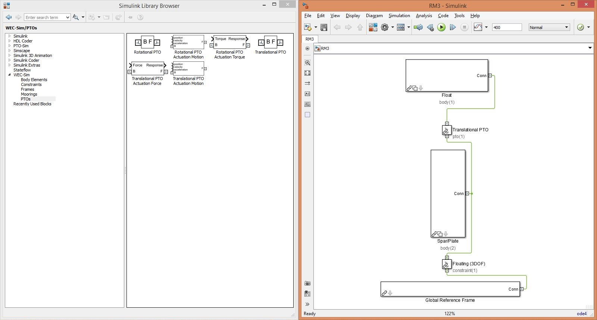

.. _examples:

Examples
========
This section gives instructions on how to run the WEC-Sim code, and provides WEC-Sim tutorials and applications.

Run WEC-Sim
------------
This section provides an overview of the WEC-Sim file structure and outlines the steps to run WEC-Sim.

File Structure Overview
~~~~~~~~~~~~~~~~~~~~~~~~~~~~~~~~
All files required for a WEC-Sim simulation must be contained within a case directory referred to as **$CASE**. This directory can be located anywhere on your computer. The table below list the WEC-Sim case directory structure and required files. 

==================   ==========================  ====================
**File Type**        **File name**               **Directory**
Input File           wecSimInputFile.m           ``$CASE``
Simulink Model       <Simulink_model_name>.slx   ``$CASE``
Hydrodynamic Data    <hydrodata_file_name>.h5    ``$CASE/hydroData``
Geometry File        <STL_file_name>.stl         ``$CASE/geometry``
==================   ==========================  ====================

Step 1: WEC-Sim Pre-Processing 
~~~~~~~~~~~~~~~~~~~~~~~~~~~~~~~~
In the pre-processing step, users need to create the model geometry, calculate the hydrodynamic coefficients, and convert the hydrodynamic coefficients into HDF5 format for WEC-Sim read:

* **3D WEC Model**: Create 3D models of the WEC and generate a meshes for each body. Export the 3D CAD model in STL format. STL files are used to visualize the WEC bodies in the WEC-Sim/MATLAB GUI, and they are used for `WEC-Sim non-linear hydro <http://wec-sim.github.io/WEC-Sim/features.html#nonlinear-hydrodynamic-forces>`_.
* **Generate hydrodynamic coefficients**: WEC-Sim requires frequency-domain hydrodynamic coefficients (added mass, radiation damping, and wave excitation). Typically, these hydrodynamic coefficients for each body of the WEC device are generated using a boundary element method (BEM) code (e.g., WAMIT, NEMOH or AQWA).
* **Create HDF5 file**: WEC-Sim reads the hydrodynamic data in HDF5 format from the (``<hydrodata_file_name>.h5``) file. `BEMIO <http://wec-sim.github.io/bemio/>`_ was developed to parse BEM solutions (from WAMIT, NEMOH and AQWA) into the required HDF5 data structure. 

.. Note::
	* WEC-Sim requires that all hydrodynamic coefficients must be given at the center of gravity for each body. 
	* If WAMIT is used, the center of gravity for each body must be at the origin of the body coordinate system (XBODY). More details on WAMIT setup are given in the `WAMIT User Manual <http://www.wamit.com/manual.htm>`_.
	* Users are able to specify their own hydrodynamic coefficients by creating their own HDF5 file with customized hydrodynamic coefficients following HDF5 format created in BEMIO.

Step 2: Build WEC-Sim model in Simulink
~~~~~~~~~~~~~~~~~~~~~~~~~~~~~~~~~~~~~~~~~~~~~~~~~~~~~~~~~~~~
In this step, users build their WEC model using the *WEC-Sim Library* developed in Simulink/SimMechanics. The figure below shows an example of a a two-body point absorber modeled using *WEC-Sim Library*.

.. figure:: _static/exampleWecModel.png
   :width: 400pt

Step 3: Write WEC-Sim input file
~~~~~~~~~~~~~~~~~~~~~~~~~~~~~~~~~~~~~~~~~~~~~~~~~~~~~~~~~~~~
The WEC-Sim input file must be created in the ``$CASE`` directory, and must be named ``wecSimInputFile.m``. The figure below shows an example of a WEC-Sim input file. The input file specifies the simulation settings, body mass properties, wave conditions, joints, and mooring. Additionally, the WEC-Sim input file must specify the filename of the WEC-Sim Simulink model, ``<Simulink_model_name>.slx``.

.. figure:: _static/runWECSim_mod.png
   :width: 600pt

Step 4: Execute WEC-Sim
~~~~~~~~~~~~~~~~~~~~~~~~~~~~~~
Execute the WEC-Sim code by typing ``wecSim`` into the MATLAB Command Window. The WEC-Sim code must be executed in the ``$CASE`` directory.

.. Note::

	WEC-Sim simulations should always be executed from the MATLAB Command Window, not from the Simulink/SimMechanics model.

Tutorials
---------
This section provides an overview of the WEC-Sim work flow. First, the WEC-Sim file structure is described; then, steps for setting up and running the WEC-Sim code are described. Two example applications of using WEC-Sim to model WECs are given. For more information about the implementation and additional features, refer to the `Code Structure <http://wec-sim.github.io/WEC-Sim/code_structure.html>`_ section and to the `Advanced Features <http://wec-sim.github.io/WEC-Sim/features.html>`_ section respectively. 

Two-Body Point Absorber (RM3)
~~~~~~~~~~~~~~~~~~~~~~~~~~~~~~~~
This section describes the application of the WEC-Sim code to model the Reference Model 3 (RM3) two-body point absorber WEC. This example application is provided in the WEC-Sim code release in the `tutorials <https://github.com/WEC-Sim/WEC-Sim/tree/master/tutorials>`_ directory.

The RM3 two-body point absorber WEC has been characterized both numerically and experimentally as a result of the DOE-funded `Reference Model Project <http://energy.sandia.gov/rmp>`_. The RM3 is a two-body point absorber consisting of a float and a reaction plate. Full-scale dimensions of the RM3 and its mass properties are shown below.

.. figure:: _static/RM3_Geom.jpg
   :width: 400pt

+-------------------------------------------------+
|Float Full Scale Properties                      |
+======+=========+================================+
|      |Mass     |Moment of                       |
+CG (m)+(tonne)  +Inertia (kg-m^2)                +
+------+---------+----------+----------+----------+
|  0   |         |20,907,301|0         |0         |
+------+         +----------+----------+----------+
|  0   |727.01   |0         |21,306,091|4305      |
+------+         +----------+----------+----------+
|-0.72 |         |0         |4305      |37,085,481|
+------+---------+----------+----------+----------+   

+-------------------------------------------------+
|Plate Full Scale Properties                      |
+======+=========+================================+
|      |Mass     |Moment of                       |
+CG (m)+(tonne)  +Inertia (kg-m^2)                +
+------+---------+----------+----------+----------+
|  0   |         |94,419,615|0         |0         |
+------+         +----------+----------+----------+
|  0   |878.30   |0         |94,407,091|217,593   |
+------+         +----------+----------+----------+
|-21.29|         |0         |217,593   |28,542,225|
+------+---------+----------+----------+----------+ 

File Structure Overview
++++++++++++++++++++++++++++
Below is an overview of the files required to run the RM3 simulation in WEC-Sim. For the RM3 WEC, there are two corresponding geometry files: ``float.stl`` and ``plate.stl``. In addition to the required files listed below, users may supply a ``userDefinedFunctions.m`` file for post-processing results once the WEC-Sim run is complete. 

==================   =====================  =========================
**Information**      **File name**          **Directory**
Input File           wecSimInputFile.m      /tutorials/rm3/
Simulink Model       rm3.slx   		    /tutorials/rm3/
Hydrodynamic Data    rm3.h5    		    /tutorials/rm3/hydroData/
Geometry File        float.stl & plate.stl  /tutorials/rm3/geometry/
==================   =====================  =========================

Step 1: WEC-Sim Pre-Processing
+++++++++++++++++++++++++++++++++++
Hydrodynamic data for each RM3 body must be parsed into a HDF5 file using the `BEMIO <http://wec-sim.github.io/bemio/>`_ hydrodynamic data format. The RM3 HDF5 file (``rm3.h5``) was created based on a WAMIT run of the RM3 geometry. The RM3 WAMIT ``rm3.out`` file and the BEMIO ``readWAMIT.py`` script were used to generate the HDF5 are included in the ``/hydroData`` directory.

Step 2: Build WEC-Sim model in Simulink
++++++++++++++++++++++++++++++++++++++++++++++++++++++++
The WEC-Sim Simulink model is created by dragging and dropping blocks from the *WEC-Sim Library* into the ``rm3.slx`` file. 

* Place two **Rigid Body** blocks from the *WEC-Sim Library* in the Simulink model file, one for each RM3 rigid body.

* Double click on the **Rigid Body** block, and rename each instance of the body. The first body must be called ``body(1)``, and the second body should be called ``body(2)``. 

.. figure:: _static/RM3_WECSim_Body.jpg
   :width: 600pt

* Place the **Global Reference Frame** from the *WEC-Sim Library* in the Simulink model file. The global reference frame acts as the seabed.

.. figure:: _static/RM3_WECSim_GlobalRef.jpg
   :width: 600pt

* Place the **Floating (3DOF)** block to connect the plate to the seabed. This constrains the plate to move in 3DOF relative to the **Global Reference Frame**. 

* Place the **Translational PTO** block to connect the float to the spar. This constrains the float to move in heave relative to the spar, and allows definition of PTO damping. 

.. Note::

	When setting up a WEC-Sim model, it is very important to note the base and follower frames.

Step 3: Write WEC-Sim input file
+++++++++++++++++++++++++++++++++
The WEC-Sim input file defines simulation parameters, body properties, joints, and mooring for the RM3 model. The ``wecSimInputFile.m`` for the RM3 is provided in the RM3 case directory, and shown below.

*wecSimInputFile for RM3*

.. literalinclude:: RM3wecSimInputFile.m
   :language: matlab
      

Step 4: Execute WEC-Sim
++++++++++++++++++++++++++++
To execute the WEC-Sim code for the RM3 tutorial, type ``wecSim`` into the MATLAB Command Window. Below is a figure showing the final RM3 Simulink model and the WEC-Sim GUI during the simulation. For more information on using WEC-Sim to model the RM3 device, refer to :cite:`ruehl_preliminary_2014`.

.. figure:: _static/RM3_WECSim_GUI.JPG
   :width: 600pt

** Output and Post-processing **
The RM3 example includes a ``userDefinedFunctions.m`` which plots RM3 forces and responses. This file can be modified by users for post-processing. Additionally, once the WEC-Sim run is complete, the WEC-Sim results are saved to the **output** variable in the MATLAB workspace.

** Running Different Wave Cases **
The default wave case for the RM3 tutorial is regularCIC, however the input file for the RM3 tutorial includes several different wave cases: 

* noWaveCIC - no wave with convolution integral calculation
* regularCIC - regular waves with convolution integral calculation
* irregular - irregular waves using a Pierson–Moskowitz spectrum with convolution integral calculation
* irregular - irregular waves using a Bretschneider Spectrum with state space calculation
* irregularImport - irregular waves using a user-defined spectrum
* userDefined - user-defined time-series

.. Note::

	If state space is used (``simu.ssCalc=1``), the user needs to make sure the state space hydrodynamic coefficients are included in the ``rm3.hd5`` file. 

  
Oscillating Surge WEC (OSWEC)
~~~~~~~~~~~~~~~~~~~~~~~~~~~~~~~~
This section describes the application of the WEC-Sim code to model the Oscillating Surge WEC (OSWEC). This example application is provided in the WEC-Sim code release in the `tutorials <https://github.com/WEC-Sim/WEC-Sim/tree/master/tutorials>`_ directory.

The OSWEC was selected because its design is fundamentally different from the RM3. This is critical because WECs span an extensive design space, and it is important to model devices in WEC-Sim that operate under different principles.  The OSWEC is fixed to the ground and has a flap that is connected through a hinge to the base that restricts the flap in order to pitch about the hinge. The full-scale dimensions of the OSWEC and the mass properties are shown in the figure and table below.

.. figure:: _static/OSWEC_Geom.png
   :width: 400pt

+-----------------------------+
|Flap Full Scale Properties   |
+======+=========+============+
|      |         |Pitch Moment|
+CG (m)+Mass (kg)+of Inertia  +
|      |         |(kg-m^2)    |
+------+---------+------------+
|  0   |         |            |
+------+         +            +
|  0   |127,000  |1,850,000   |
+------+         +            +
| -3.9 |         |            |
+------+---------+------------+

File Structure Overview
++++++++++++++++++++++++++++
Below is an overview of the files required to run the OSWEC simulation in WEC-Sim. For the OSWEC, there are two corresponding geometry files: ``flap.stl`` and ``base.stl``. In addition to the required files listed below, users may supply a ``userDefinedFunctions.m`` file for post-processing results once the WEC-Sim run is complete. 

==================   =====================  ===========================
**Information**      **File name**          **Directory**
Input File           wecSimInputFile.m      /tutorials/oswec/
Simulink Model       oswec.slx   	    /tutorials/oswec/
Hydrodynamic Data    oswec.h5    	    /tutorials/oswec/hydroData/
Geometry File        flap.stl & base.stl    /tutorials/oswec/geometry/
==================   =====================  ===========================

Step 1: WEC-Sim Pre-Processing
+++++++++++++++++++++++++++++++++++++++++++
Hydrodynamic data for each OSWEC body must be parsed into a HDF5 file using the `BEMIO <http://wec-sim.github.io/bemio/>`_ hydrodynamic data format. The OSWEC HDF5 file (``oswec.h5``) was created based on a WAMIT run of the RM3 geometry. The OSWEC WAMIT ``oswec.out`` file and the BEMIO ``readWAMIT.py`` script used to generate the HDF5 are included in the ``/hydroData`` directory.

Step 2: Build WEC-Sim model in Simulink
++++++++++++++++++++++++++++++++++++++++++++++++++++++++
The WEC-Sim Simulink model is created by dragging and dropping blocks from the *WEC-Sim Library* into the ``oswec.slx`` file. 

* Place two **Rigid Body** blocks from the *WEC-Sim Library* in the Simulink model file, one for each OSWEC rigid body. 

* Double click on the **Rigid Body** block, and rename each instance of the body. The first body must be called ``body(1)``, and the second body should be called ``body(2)``. 
   
.. figure:: _static/OSWEC_WECSim_Body.jpg
   :width: 600pt  

* Place the **Global Reference Frame** from the *WEC-Sim Library* in the Simulink model file. The global reference frame acts as the seabed.

.. figure:: _static/OSWEC_WECSim_GlobalRef.jpg
   :width: 600pt

* Place the **Fixed** block to connect the base to the seabed. This constrains the base to be fixed relative to the **Global Reference Frame**. 

* Place a **Rotational PTO** block to connect the base to the flap. This constrains the flap to move in pitch relative to the base, and allows definition of PTO damping. 

.. figure:: _static/OSWEC_WECSim.JPG
   :width: 600pt

.. Note::

	When setting up a WEC-Sim model, it is very important to note the base and follower frames.

Step 3: Write WEC-Sim input file
++++++++++++++++++++++++++++++++++++++++++++++++++++++++
The WEC-Sim input file defines simulation parameters, body properties, joints, and mooring for the OSWEC model. The ``wecSimInputFile.m`` for the OSWEC is provided in the OSWEC case directory, and shown below.

*wecSimInputFile.m for OSWEC*

.. literalinclude:: OSWECwecSimInputFile.m
   :language: matlab

Step 4: Execute WEC-Sim
++++++++++++++++++++++++++++
To execute the WEC-Sim code for the OSWEC tutorial, type ``wecSim`` into the MATLAB Command Window. Below is a figure showing the final OSWEC Simulink model and the WEC-Sim GUI during the simulation. For more information on using WEC-Sim to model the OSWEC device, refer to :cite:`y._yu_development_2014,y._yu_design_2014`.

.. figure:: _static/OSWEC_WECSim_GUI.jpg
   :width: 600pt

References
~~~~~~~~~~~~~~~~~~~~~~~~~~~~~~~~
.. bibliography:: WEC-Sim_Tutorials.bib
   :style: unsrt   

WEC-Sim Applications 
--------------------
The `WEC-Sim Applications <https://github.com/WEC-Sim/WEC-Sim_Applications>`_ repository contains applications of the WEC-Sim code, including tutorials by the WEC-Sim team as well as user-shared examples. The WEC-Sim Applications respository is included as a `submodule <https://git-scm.com/book/en/v2/Git-Tools-Submodules>`_ of the WEC-Sim respository.

