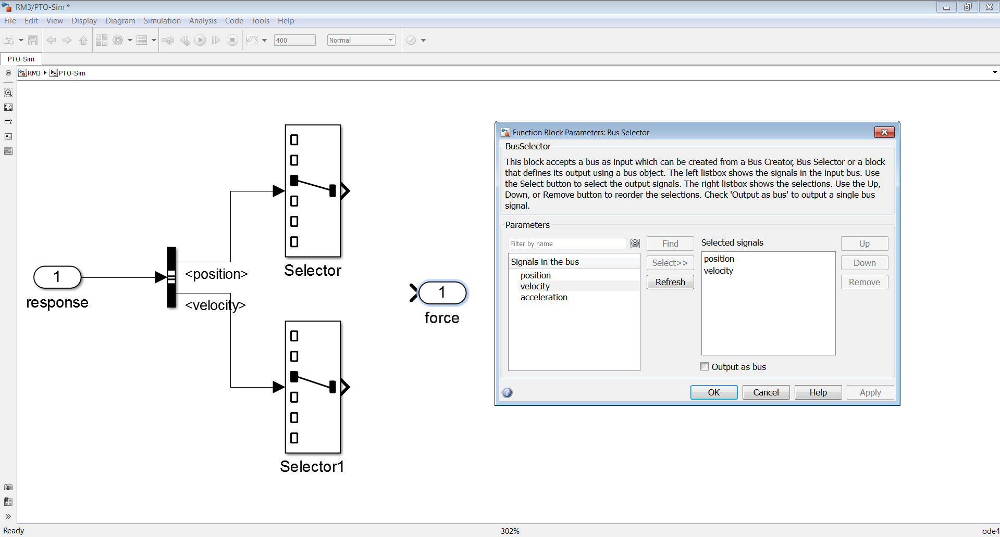
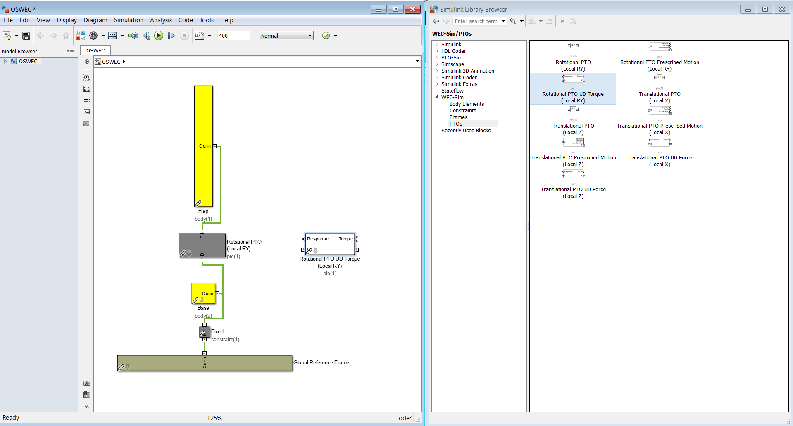

Constraint and PTO Features
----------------------------
This section provides an overview of  WEC-Sim's constraint and pto classes; for more information about the constraint and pto classes' code structure, refer to `Constraint Class <http://wec-sim.github.io/WEC-Sim/code_structure.html#constraint-class>`_ and `PTO Class <http://wec-sim.github.io/WEC-Sim/code_structure.html#pto-class>`_.

Modifying Constraints and PTOs
^^^^^^^^^^^^^^^^^^^^^^^^^^^^^^^
The default linear and rotational constraints and PTOs allow for heave and pitch motions of the follower relative to the base.
To obtain a linear or rotational constraint in a different direction you must modify the constraint's or PTO's coordinate orientation.
The important thing to remember is that a linear constraint or PTO will always allow motion along the joint's Z-axis, and a rotational constraint or PTO will allow rotation about the joint's Y-axis.
To obtain translation along or rotation about a different direction relative to the global frame, you must modify the orientation of the joint's coordinate frame.
This is done by setting the constraint's or PTO's :code:`orientation.z` and :code:`orientation.y` properties which specify the new direction of the Z- and Y- joint coordinates.
The Z- and Y- directions must be perpendicular to each other.

As an example, if you want to constrain body 2 to surge motion relative to body 1 using a linear constraint, you would need the constraint's Z-axis to point in the direction of the global surge (X) direction.
This would be done by setting :code:`constraint(i).orientation.z=[1,0,0]` and the Y-direction to any perpendicular direction (can be left as the default y=[0 1 0]).
In this example, the Y-direction would only have an effect on the coordinate on which the constraint forces are reported but not on the dynamics of the system.
Similarly if you want to obtain a yaw constraint you would use a rotational constraint and align the constraint's Y-axis with the global Z-axis.
This would be done by setting :code:`constraint(i).orientation.y=[0,0,1]` and the  z-direction to a perpendicular direction (say [0,-1,0]).

.. Note::

	When using the Actuation Force/Torque PTO or Actuation Motion PTO blocks, the loads and displacements are specified in the local (not global) coordinate system. This is true for both the sensed (measured) and actuated (commanded) loads and displacements.

Additionally, by combining constraints and PTOs in series you can obtain different motion constraints. 
For example, a massless rigid rod between two bodies, hinged at each body, can be obtained by using a two rotational constraints in series, both rotating in pitch, but with different locations.
A roll-pitch constraint can also be obtained with two rotational constraints in series; one rotating in pitch, and the other in roll, and both at the same location. 

PTO-Sim
^^^^^^^^^^^^^^^^^^^^^^^^^^^^^^^
PTO-Sim is the WEC-Sim module responsible for accurately modeling a WEC's conversion of mechanical power to electrical power. 
While the PTO blocks native to WEC-Sim are modeled as a simple linear spring-damper systems, PTO-Sim is capable of modeling many power conversion chains (PCC) such as mechanical drivetrain and hydraulic drivetrain. 
PTO-Sim is made of native Simulink blocks coupled with WEC-Sim, using WEC-Sim's user-defined PTO blocks, where the WEC-Sim response (relative displacement and velocity for linear motion and angular position and velocity for rotary motion) is the PTO-Sim input. 
Similarly, the PTO force or torque is the WEC-Sim input. 
For more information on how PTO-Sim works, refer to [So et al., 2015], and the `PTO and Control webinar <http://wec-sim.github.io/WEC-Sim/webinars.html#webinar-3-pto-and-control>`_.

The files for the PTO-Sim tutorials described in this section can be found in the `WEC-Sim Applications repository <https://github.com/WEC-Sim/WEC-Sim_Applications>`_ **PTO-Sim** example.

Tutorial: RM3 with PTO-Sim
""""""""""""""""""""""""""""""
This section describes how to use RM3 with PTO-Sim. Two tutorials will be given in this section: one for the RM3 with a hydraulic PTO (non-compressible) and another for the RM3 with a direct drive PTO.

RM3 with Hydraulic PTO
++++++++++++++++++++++++++++++
The hydraulic PTO example used in this section consists of a piston, a rectifying valve, a high pressure accumulator, a hydraulic motor coupled to a rotary generator, and a low pressure accumulator.   

.. figure:: _images/HYDPHYMODEL.PNG
   :width: 400pt 

There are two ways of modeling the hydraulic PTO: with a compressible fluid hydraulic, and with a non-compressible fluid hydraulic. The compressible fluid model uses the properties of fluid such as an effective bulk modulus and density while the non-compressible fluid does not.

In this section, a step by step tutorial on how to set up and run the RM3 simulation with PTO-Sim is provided. All the files used in WEC-Sim will remain the same. An additional file that is needed is the PTO-Sim input file (``ptoSimInputFile.m``). If the rotary generator lookup table is used, a datasheet that contains generator efficiency, torque, and angular velocity is needed and should be named as ``table`` in Workspace (``table.eff``, ``table.Tpu``,and ``table.omegapu``). More details, refer to `Step 8`_. In summary, the files need to run RM3 with PTO-Sim case are the following:

* WEC-Sim input file: ``wecSimInputFile.m`` (make sure to set the PTO linear damping to zero)
* Simulink model: ``RM3.slx``
* Geometry file for each body: ``float.stl`` and ``plate.stl``
* Hydrodynamic data file(s): ``rm3.h5``
* Optional user defined post-processing file: ``userDefinedFunction.m``
* PTO-Sim input file: ``ptoSimInputFile.m``
* Datasheet for the rotary generator: ``table`` (``table.eff``, ``table.Tpu``,and ``table.omegapu``)
* For the hydraulic PTOs: ``variableMotorVolume.m``

**Simulink Model**
The Simulink model can be built as follows:

* Step 1: Navigate to the RM3 tutorial ``$WECSIM/tutorials/RM3``.

* Step 2: Open ``RM3.slx`` file and replace Translational PTO (local Z) with Translational PTO UD Force (Local Z). 

.. figure:: _images/TRANSLATIONALPTOUD.PNG
   :width: 400pt 

* Step 3: Use a subsystem and rename it to PTO-Sim where input is response and output is force.

.. figure:: _images/RM3WITHPTOSIMBLOCK.PNG
   :width: 400pt

* Step 4: Go inside PTO-Sim block and add one bus selector and two selector blocks. Since PTO-Sim block is connected to the WEC-Sim translational joint block, you can select position and velocity and therefore "signal1" and "signal2" will change to "position" and "velocity". Because the heave motion is driving the piston, selection index of each selector needs to be changed to 3.

* Step 5: Go to Simulink Library Browser to access PTO-Sim Library. 

.. figure:: _images/OPENPTOSIMLIB.PNG
   :width: 400pt

* Step 6: By looking at the physical hydraulic PTO model as shown above, user can simply drag and drop PTO-Sim library blocks. Piston, valves, accumulator blocks are located under the Hydraulic block. Rotary generator lookup table is under the Generator block. 

.. figure:: _images/USEPTOSIMLIB.PNG
   :width: 400pt

* Step 7: Since two accumulators are needed for the high pressure accumulator and low pressure accumulator, the user needs to double-click on each block and give a number to each accumulator. For example, ``ptosim.accumulator(1)`` is called high pressure accumulator and ``ptosim.accumulator(2)`` is called low pressure accumulator.

.. figure:: _images/MULTIPLEACCUMULATORS.PNG
   :width: 400pt

.. _`Step 8`:

* Step 8: If a rotary generator lookup table is used, this block assumes the user will provide the datasheet. After the datasheet is loaded into ``Workspace``, it needs to be named as ``table`` because the word ``table`` is used inside Simulink lookup table block. The datasheet in tutorials is taken from ABB datasheet part number M3BJ315SMC. The lookup table takes three inputs: efficiency (``table.eff``), angular velocity (``table.Tpu``), and generator torque (``table.omegapu``), respectively. 

.. figure:: _images/ROTARYHIGHLEVELBLOCK.PNG
   :width: 400pt

.. figure:: _images/ROTARYBLOCK.PNG
   :width: 400pt

.. figure:: _images/ROTARYGENLOOKUPTABLE.PNG
   :width: 400pt

* Step 9: After the high pressure and low pressure accumulators have been identified, and the rotary generator lookup table datasheet has been setup, all the blocks can be connected together. 

Position and velocity from selectors are used as inputs to the compressible fluid piston. This block also needs to know top and bottom volumetric flows which come from the rectifying check valve. The piston then outputs PTO force that will be used by WEC-Sim. Two other outputs are the piston pressures. The rectifying check valve takes both the pressures from the piston and accumulators. Both high and low pressure accumulators take the volumetric flows from the rectifying check valve and hydraulic motor. The hydraulic motor uses the knowledge of the pressures from both accumulator and generator torque from the rotary generator. The rotary generator needs angular velocity from the hydraulic motor. The figure below shows how to connect all the blocks together.

.. figure:: _images/HYDPTOSIM.PNG
   :width: 400pt

**Input File**
In this section, PTO-Sim input file (``ptoSimInputFile.m``) is defined and categorized into sections such as piston, rectifying check valve, high pressure accumulator, hydraulic motor, low pressure accumulator, and rotary generator.

.. figure:: _images/PTOSIMINPUTFILE.PNG
   :width: 400pt

**Simulation and Post-processing**
Simulation and post-processing are the same process as described in WEC-Sim Simulation example above.

RM3 with Direct Drive PTO
++++++++++++++++++++++++++++++
A mechanical PTO is used in this example and is modeled as a direct drive linear generator. The main components of this example consist of magnets and a coil where the magnet assembly is attached to the heaving float and the coil is located inside the spar. As the float moves up and down, the magnet assembly creates a change in the magnetic field surrounding the spar that contains the coil: therefore, current is induced in the coil and electricity is generated.

.. figure:: _images/MECHANICALPTO.PNG
   :width: 400pt

**Simulink Model**
Step 1 through 3 are the same as in `RM3 with hydraulic PTO`_.

* Step 4: Go inside PTO-Sim block and add one bus selector and one selector blocks. Only velocity is needed for this example.

.. figure:: _images/SELECTORS2.PNG
   :width: 400pt

* Step 5: Go to PTO-Sim library.
* Step 6: By looking at the physical mechanical PTO model as shown above, the user can simply drag and drop PTO-Sim library blocks. In this case, only the direct drive linear generator is needed, and it is located under the generator box.

.. figure:: _images/USEPTOSIMLIB2.PNG
   :width: 400pt

* Step 7: Simply connect velocity from the selector to the input of the direct drive linear generator. The output PTO force is fed back to WEC-Sim. 

.. figure:: _images/DDLINEARGENPTOSIM.PNG
   :width: 400pt

**Input File, Simulation, and Post-processing**
The same as `RM3 with hydraulic PTO`_.

Tutorial: OSWEC with PTO-Sim
"""""""""""""""""""""""""""""""""""""""""""""
This section describes how to use the OSWEC model with PTO-Sim. The same process as described in `RM3 with PTO-Sim <http://wec-sim.github.io/WEC-Sim/features.html#tutorial-rm3-with-pto-sim>`_ ; however, since the OSWEC is a rotary device, it takes torque as an input and a rotary to linear motion conversion block is needed. The tutorials can be found on the `WEC-Sim Applications <https://github.com/WEC-Sim/WEC-Sim_Applications>`_ repository (both for a crank and for a rod).

OSWEC with Hydraulic PTO
++++++++++++++++++++++++++++++
A hydraulic PTO or mechanical PTO can be used with OSWEC but for simplicity a hydraulic PTO will be used as an example.

.. figure:: _images/OSWECPHYMODEL.PNG
   :width: 400pt

.. figure:: _images/MoTIONMECHANISM.PNG
   :width: 400pt

**Modeling of OSWEC with Hydraulic PTO**
The same as `RM3 with hydraulic PTO`_.

**Simulink Model**
The Simulink model can be built as following:

* Step 1: Copy OSWEC tutorial folder to get started  ``$WECSIM\tutorials\OSWEC``. 

* Step 2: Open ``OSWEC.slx`` file and replace Rotary PTO (Local RY) with Rotational PTO UD Torque (Local RY).

* Step 3: Use a subsystem and rename it to PTO-Sim where input is response and output is torque.

.. figure:: _images/OSWECWITHPTOSIMBLOCK1.PNG
   :width: 400pt

* Step 4: Go inside PTO-Sim block and drag and drop one bus selector and two selector blocks. Since pitch is driving the piston, selection index of each selector needs to be changed to 5. Next, go to PTO-Sim library and drag and drop all the blocks for the hydraulic PTO. The rotary to linear adjustable rod block can be found under rotary to linear conversion box. 

.. figure:: _images/USEPTOSIMLIB3.PNG
   :width: 400pt

* Step 5: The rotary to linear adjustable rod block takes angular position and velocity from index selector blocks and PTO force from compressible fluid piston block. The outputs of the rotary to linear adjustable rod block are linear position, velocity, and torque. Linear position and velocity are used as inputs for compressible fluid piston and torque is fed back to WEC-Sim. The rest of the connections are the same as in RM3 with hydraulic PTO. The user is encouraged to go up one level to check the connections between PTO-Sim and WEC-Sim.  

.. figure:: _images/HYDPTOSIMOSWEC.PNG
   :width: 400pt

**Input File, Simulation, and Post-processing**
The same as `RM3 with hydraulic PTO`_.

Other PTO-Sim Tutorials
""""""""""""""""""""""""""""""

Other PTO-Sim tutorials that were not discussed above can be found on the `WEC-Sim Applications <https://github.com/WEC-Sim/WEC-Sim_Applications>`_ repository.

	+--------------------------------+-------------------------------------------+
	|     **PTO-Sim Application**    |               **Description**             |                
	+--------------------------------+-------------------------------------------+
	|   RM3_Hydraulic_PTO            | RM3 with hydraulic PTO                    |
	+--------------------------------+-------------------------------------------+
	|   RM3_cHydraulic_PTO           | RM3 with compressible hydraulic PTO       |
	+--------------------------------+-------------------------------------------+
	|   RM3_DD_PTO                   | RM3 with direct drive linear generator    |
	+--------------------------------+-------------------------------------------+
	|   OSWEC_Hydraulic_PTO          | OSWEC with hydraulic PTO (adjustable rod) |
	+--------------------------------+-------------------------------------------+
	|   OSWEC_Hydraulic_Crank_PTO    | OSWEC with hydraulic PTO (crank)          |
	+--------------------------------+-------------------------------------------+