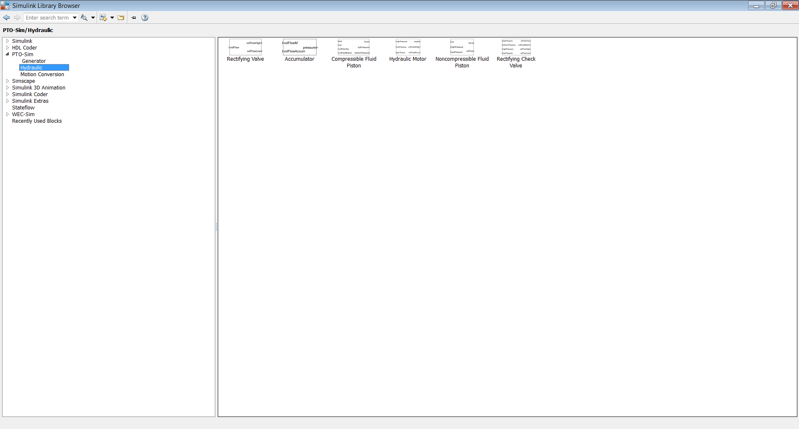
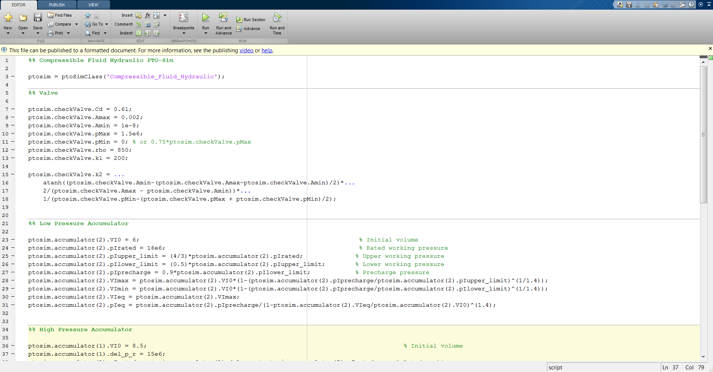
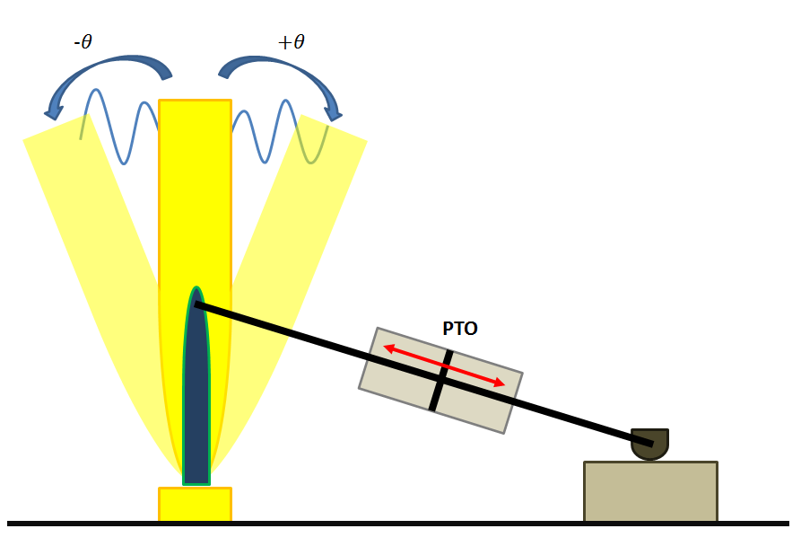
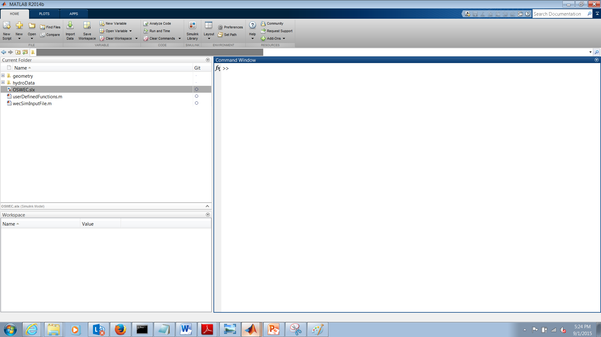
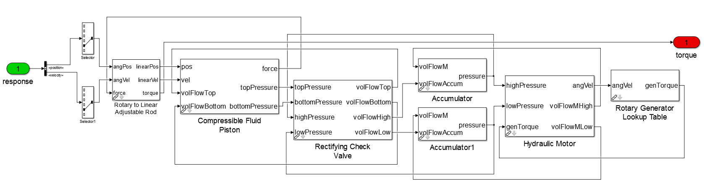

.. _tutotials:

Tutorials
==================
This section describes how to use the WEC-Sim code to model two different WECs. The first application models a two-body point absorber WEC, and the second application models an OSWEC. RM3 Two-Body Point Absorber and Oscillating Surge-Pitch Device sections use a simple linear damper while RM3 with PTO-Sim and OSWEC with PTO-Sim can model PTO as hydraulic or mechanical. The files corresponding to these examples are included in the tutorials directory of the WEC-Sim source code.

RM3 Two-Body Point Absorber
----------------------------

Geometry Definition
~~~~~~~~~~~~~~~~~~~~~~~~~~~~~~

The first application of the WEC-Sim code is the Reference Model 3 (RM3) two-body point absorber design. Although the WEC is free to move in all 6DOF in response to wave motion, power is captured only in the relative heave direction. The RM3 device was selected because the design has already been well characterized both numerically and experimentally as a result of the DOE-funded Reference Model Project, more information on this project available on the  `Reference Model website <http://energy.sandia.gov/rmp>`_. In addition, the device has relatively simple operating principles and is representative of designs WEC industry is currently pursuing. RM3 is a simple two-body point absorber, consisting of a float and a reaction plate. The full-scale dimensions of the RM3 and its mass properties are are shown below.

.. figure:: _static/RM3_Geom.jpg
   :width: 400pt

+-------------------------------------------------+
|Float Full Scale Properties                      |
+======+=========+================================+
|      |Mass     |Moment of                       |
+CG (m)+(tonne)  +Inertia (kg-m^2)                +
+------+---------+----------+----------+----------+
|  0   |         |20,907,301|0         |0         |
+------+         +----------+----------+----------+
|  0   |727.01   |0         |21,306,091|4305      |
+------+         +----------+----------+----------+
|-0.72 |         |          |4305      |37,085,481|
+------+---------+----------+----------+----------+   

+-------------------------------------------------+
|Plate Full Scale Properties                      |
+======+=========+================================+
|      |Mass     |Moment of                       |
+CG (m)+(tonne)  +Inertia (kg-m^2)                +
+------+---------+----------+----------+----------+
|  0   |         |94,419,615|0         |0         |
+------+         +----------+----------+----------+
|  0   |878.30   |0         |94,407,091|217,593   |
+------+         +----------+----------+----------+
|-21.29|         |          |217,593   |28,542,225|
+------+---------+----------+----------+----------+ 

Hydrodynamic Data Pre-Processing
~~~~~~~~~~~~~~~~~~~~~~~~~~~~~~~~~~~
The hydrodynamic data for each body must be supplied in `bemio` hydrodynamic data format generated using the `bemio <http://wec-sim.github.io/bemio/>`_ code. The hydrodynamic data for each body can be supplied in one single ''hdf5'' file, or several (ie. one per body). In this application case, a single file is provided. This file was created based on a WAIMT run of the RM3 geometry, using the WAMIT output file and the WAMIT reader from the  bemio. The WAMIT ``*.out`` file and the python `bemio` script used to create the `hdf5` are included as well. All these files are located in the ``/hydroData`` directory of the RM3 application case.

Modeling RM3 in WEC-Sim
~~~~~~~~~~~~~~~~~~~~~~~~~~~~~~
In this section,   a step by step tutorial on how to set up and run the RM3 simulation in WEC-Sim is provided. 

All WEC-Sim models consist of a input file (``wecSimInputFile.m``), and a Simulink model file (``RM3.slx``). To run the WEC-Sim simulation, the user needs to provide results from the frequency-domain BEM solver, to populate the WEC-Sim hydrodynamic coefficients. These results must be provided in the form of one or several  ``*.h5`` file(s) as described in Section 3.1.2. The user also needs to specify the 3-D geometry file for each body  in the form of a ``*.stl`` file with the origin of the coordinate system at the center of gravity. this is used for the WEC-Sim visualization. For the RM3 run consisting of a buoy and a spar plate, these files correspond to the ``float.stl`` and ``plate.stl`` files respectively. The RM3 ``*.stl`` files are located in the ''/geometry'' directory. Additionally users have the option of supplying a ``userDefinedFunctions.m`` file for post-processing immediately after the WEC-Sim run is complete. In summary, the files needed to run a WEC-Sim case are the following:

* Input file: ``wecSimInputFile.m``
* Simulink model: ``rm3.slx``
* Geometry file for each body: ``float.stl`` and ``plate.stl``
* Hydrodynamic data file(s): ``rm3.h5`` 
* Optional user defined postprocessing file: ``userDefinedFunctions.m``

Simulink Model
....................

The first step to initiate a WEC-Sim simulation is to create the Simulink model file by dragging and dropping blocks from the WEC-Sim library into the ``rm3.slx`` file. 

* Step 1: Place two ``Rigid Body`` blocks from the WEC-Sim library in the Simulink model file, one for each RM3 rigid body, as shown in the figure below. 

.. figure:: _static/RM3_WECSim_Body.jpg
   :width: 400pt

* Step 2: Double click on the ``Rigid Body`` block, and rename the instances of the body. The first body should be titled 'body(1)', and the second body should be titled ``'body(2)'``. Additional properties of these body blocks are defined in the following RM3 MATLAB input file.

* Step 3: Place the ``Global Reference Frame`` from the WEC-Sim library in the Simulink model file, as shown in the figure below. The global reference frame acts as the seabed to which all other bodies are linked through joints or constraints.

.. figure:: _static/RM3_WECSim_GlobalRef.jpg
   :width: 400pt

* Step 4: Use the ``Floating constraint`` block to connect the plate to the seabed. This is done because the RM3 is free to move relative to the global reference frame. Step 4 and 5 connections are shown in the figure below. 

* Step 5: Place a ``Translational PTO (Local Z)`` block to connect the float to the spar. This is necessary because the float is restricted to heave motion relative to the plate. For the RM3 simulation, the translational PTO block is used to model the WEC's PTO as a linear damper. The parameters are defined in the RM3 MATLAB input file.

.. figure:: _static/RM3_WECSim.JPG
   :width: 400pt

When setting up a WEC-Sim model, it is important to note the base and follower frames. For example, for the constraint between the plate and the reference frame should be the base because the plate moves relative to it.  Similarly, for the PTO between the float and the plate, the plate should be defined as the base and the float as the follower.

Input File
.................

In this section, we define the WEC-Sim MATLAB input file for the RM3 model. Each of the lines are commented to explain the purpose of the defined parameters. For the RM3 model, the user must define the simulation parameters, body properties, PTO, and constraint definitions. The specified input parameters for RM3 are shown in the figure below.

.. figure:: _static/RM3wecSimInputFile.png
   :width: 400pt

.. _`RM3 with WEC-Sim`:
.. _Simulation:

Simulation
~~~~~~~~~~~~~~~~~

Once the WEC-Sim Simulink model is set up and the RM3 properties are defined in the MATLAB input file, the user can then run the RM3 model in WEC-Sim by running the ``wecSim`` command from the MATLAB Command Window. The figure below shows the final RM3 Simulink model and the WEC-Sim GUI during the simulation. For more information on using WEC-Sim to model the RM3 device, refer to :cite:`ruehl_preliminary_2014`.

.. figure:: _static/RM3_WECSim_GUI.JPG
   :width: 400pt

Outputs and Postprocessing
.................................

This example has a ``userDefinedFunctions.m`` which plots different forces and responses. The user is encouraged to modify this file. Additionally, after the WEC-Sim run is done, the user has access to the ``output`` variable in the workspace which contains all the simulation outputs.

Running Different Wave Cases
.................................

The input file in the RM3 example has four different wave examples: 
* Regular waves
* Irregular waves with using Pierson–Moskowitz spectrum with convolution integral calculation
* Irregular waves with using Bretschneider Spectrum with state space calculation
* Irregular waves with defined spectrum, and irregular waves with a user defined spectrum

By default the regular waves case is used. To run either of the other three cases the user needs to comment out the regular wave case and uncomment the desired case. Additionally, the user can create any other desired wave. 

Note: If ``simu.ssCalc=1`` is uncommented, the user needs to make sure the the state space hydrodynamic coefficients are included in the ``<hydro-data name>.hd5`` file. User can generate the state space hydrodynamic coefficients and export the values in the ``<hydro-data name>.hd5`` file using the bemio code. More details are discribed in the `Calculating Impulse Response Functions and Sate Space Coefficients <http://wec-sim.github.io/bemio/api.html#calculating-impulse-response-functions-and-sate-space-coefficients>`_ section in the `bemio` Documentation and Users Guide

.. _`RM3 with PTO-Sim`:

RM3 with PTO-Sim
----------------------------

This section describes how to use RM3 with PTO-Sim, the WEC-Sim module responsible for accurately modeling a WEC's conversion of mechanical power to electrical power. While the PTO used in the WEC-Sim example above is modeled as a simple linear damper, PTO-Sim is capable of modeling many power conversion chains (PCC) such as mechanical drivetrain and hydraulic drivetrain. PTO-Sim is made of native Simulink blocks coupled with WEC-Sim, using WEC-Sim's user-defined PTO blocks, where the WEC-Sim response (relative displacement and velocity for linear motion and angular position and velocity for rotary motion) is the PTO-Sim input. Similarly, the PTO force or torque is the WEC-Sim input. For more information on how PTO-Sim works, refer to :cite:`so_development_2015`.

Two tutorials will be given in this section, one for the RM3 with a hydraulic PTO, and another for the RM3 with a mechanical PTO.

RM3 with Hydraulic PTO
~~~~~~~~~~~~~~~~~~~~~~~~~

The hydraulic PTO example used in this section consists of a piston, a rectifying valve, a high pressure accumulator, a hydraulic motor coupled to a rotary generator, and a low pressure accumulator.   

.. figure:: _static/HYDPHYMODEL.PNG
   :width: 400pt 

There are two ways of modeling the hydraulic PTO: with a compressible fluid hydraulic, and with a non-compressible fluid hydraulic. The compressible fluid model uses the properties of fluid such as an effective bulk modulus and density while the non-compressible fluid does not.
  
Modeling RM3 with Hydraulic PTO
~~~~~~~~~~~~~~~~~~~~~~~~~~~~~~~~~~~~~~~~~

In this section, a step by step tutorial on how to set up and run the RM3 simulation with PTO-Sim is provided. All the files used in WEC-Sim will remain the same. An additional file that is needed is the PTO-Sim input file (``ptoSimInputFile.m``). If the rotary generator lookup table is used, a datasheet that contains generator efficiency, torque, and angular velocity is needed and should be named as ``table`` in Workspace (``table.eff``, ``table.Tpu``,and ``table.omegapu``). More details, refer to `Step 8`_. In summary, the files need to run RM3 with PTO-Sim case are the following:

* WEC-Sim input file: ``wecSimInputFile.m`` (make sure to set the PTO linear damping to zero)
* Simulink model: ``RM3.slx``
* Geometry file for each body: ``float.stl`` and ``plate.stl``
* Hydrodynamic data file(s): ``rm3.h5``
* Optional user defined postprocessing file: ``userDefinedFunction.m``
* PTO-Sim input file: ``ptoSimInputFile.m``
* Datasheet for the rotary generator: ``table`` (``table.eff``, ``table.Tpu``,and ``table.omegapu``)

.. _`RM3 with hydraulic PTO`:

Simulink Model
....................

The Simulink model can be built as following:

* Step 1: User can get started from RM3 example.

.. figure:: _static/COPYRM3.PNG
   :width: 400pt

* Step 2: Open ``RM3.slx`` file and replace Translational PTO (local Z) with Translational PTO UD Force (Local Z). 

.. figure:: _static/TRANSLATIONALPTOUD.PNG
   :width: 400pt 

* Step 3: Use a subsystem and rename it to PTO-Sim where input is response and output is force.

.. figure:: _static/RM3WITHPTOSIMBLOCK.PNG
   :width: 400pt

* Step 4: Go inside PTO-Sim block and add one bus selector and two selector blocks. Since PTO-Sim block is connected to the WEC-Sim translational joint block, you can select position and velocity and therefore <signal1> and <signal2> will change to <position> and <velocity>. Because the heave motion is driving the piston, selection index of each selector needs to be changed to 3.

.. figure:: _static/SELECTORS.PNG
   :width: 400pt

* Step 5: Go to Simulink Library Browser to access PTO-Sim Library. 

* Step 6: By looking at the physical hydraulic PTO model as shown above, user can simply drag and drop PTO-Sim library blocks. Piston, valves, accummulator blocks are located under Hydraulic block. Rotary generator lookup table is under Generator block. 

.. figure:: _static/USEPTOSIMLIB.PNG
   :width: 400pt

* Step 7: Since two accumulators are needed for the high pressure accumulator and low pressure accumulator, user need to douple-click on each block and give a number to each accumulator. For example, ``ptosim.accumulator(1)`` is called high pressure accumulator and ``ptosim.accumulator(2)`` is called low pressure accumulator.

.. figure:: _static/MULTIPLEACCUMULATORS.PNG
   :width: 400pt

.. _`Step 8`:

* Step 8: If a rotary generator lookup table is used, this block assumes user will provide the datasheet. After the datasheet is loaded into ``Workspace``, it needs to be named as ``table`` because the word ``table`` is used inside Simulink lookup table block. The datasheet in tutorials is taken from ABB datasheet part number M3BJ315SMC. The lookup table takes three inputs: efficiency (``table.eff``), anglular velocity (``table.Tpu``), and generator torque (``table.omegapu``), respectively. 

.. figure:: _static/ROTARYHIGHLEVELBLOCK.PNG
   :width: 400pt

.. figure:: _static/ROTARYBLOCK.PNG
   :width: 400pt

.. figure:: _static/ROTARYGENLOOKUPTABLE.PNG
   :width: 400pt

* Step 9: After the high pressure and low pressure accumulators have been identified, and the rotary generator lookup table datasheet has been setup, all the blocks can be connected together. 

Position and velocity from selectors are used as inputs of compressible fluid piston. This block also needs to know top and bottom volumetric flows which come from the rectifying check valve. The piston then outputs PTO force that will be used by WEC-Sim. Two other outputs are the piston pressures. Rectifying check valve takes both the pressures from the piston and accumulators. Both high and low pressure accumulators takes the volumetric flows from the rectifying check valve and hydraulic motor. Hydraulic motor uses the knowledge of the pressures from both accumulator and generator torque from the rotary generator. The rotary generator needs angular velocity from the hydraulic motor. Figure below shows how to connect all the blocks together.

.. figure:: _static/HYDPTOSIM.PNG
   :width: 400pt

Input File
....................

In this section, PTO-Sim input file (``ptoSimInputFile.m``) is defined and categorized into sections such as piston, rectifying check valve, high pressure accumulator, hydraulic motor, low pressure accumulator, and rotary generator.

Simulation and Postprocessing
...............................

Simulation and postprocessing are the same process as described in WEC-Sim Simulation_ example above.

RM3 with Mechanical PTO
~~~~~~~~~~~~~~~~~~~~~~~~~

A mehchanical PTO is used in this example is modeled as a direct drive linear generator. The main components of this example consist of magnets and coil where the magnet assembly is attached to the heaving float and the coil is locacted inside the spar. As the float moves up and down, the magnet assembly creates a change in magnetic field surrond the spar that contains the coil. Therefore, current is induced in the coil and electricity is generated.

.. figure:: _static/MECHANICALPTO.PNG
   :width: 400pt

Modeling RM3 with Mechanical PTO
~~~~~~~~~~~~~~~~~~~~~~~~~~~~~~~~~~~~~~~~~

Simulink Model
....................

Step 1 through 3 are the same as in `RM3 with hydraulic PTO`_.

* Step 4: Go inside PTO-Sim block and add one bus selector and one selector blocks. Only velocity is needed for this example.

.. figure:: _static/SELECTORS2.PNG
   :width: 400pt

* Step 5: Go to PTO-Sim library.
* Step 6: By looking at the physical mechanical PTO model as shown above, user can simply drag and drop PTO-Sim library blocks. In this case, only the direct drive linear generator is needed and it is located under generator box.

.. figure:: _static/USEPTOSIMLIB2.PNG
   :width: 400pt

* Step 7: Simply connect velocity from the selector to the input of the direct drive linear generator. The ouput PTO force is fed back to WEC-Sim. 

.. figure:: _static/DDLINEARGENPTOSIM.PNG
   :width: 400pt

Input File, Simulation, and Postprocessing
..............................................

The same as `RM3 with WEC-Sim`_. 
  
Oscillating Surge-Pitch Device
--------------------------------

Geometry Definition
~~~~~~~~~~~~~~~~~~~~~~~~~~~~~~

As the second application of the WEC-Sim code, the oscillating surge WEC (OSWEC) device. We selected the OSWEC because its design is fundamentally different from the RM3. This is critical because WECs span an extensive design space, and it is important to model devices in WEC-Sim that operate under different principles.  The OSWEC is fixed to the ground and has a flap that is connected through a hinge to the base that restricts the flap to pitch about the hinge. The full-scale dimensions of the OSWEC and the mass properties are shown in the figure and table below.

.. figure:: _static/OSWEC_Geom.png
   :width: 400pt

+-----------------------------+
|Flap Full Scale Properties   |
+======+=========+============+
|      |         |Pitch Moment|
+CG (m)+Mass (kg)+of Inertia  +
|      |         |(kg-m^2)    |
+------+---------+------------+
|  0   |         |            |
+------+         +            +
|  0   |127,000  |1,850,000   |
+------+         +            +
| -3.9 |         |            |
+------+---------+------------+

Hydrodynamic Data Pre-Processing
~~~~~~~~~~~~~~~~~~~~~~~~~~~~~~~~~

The hydrodynamic data for each body must be supplied in `bemio` hydrodynamic data format generated using the `bemio`_ code.  More information on how to use `bemio` can be found here - http://wec-sim.github.io/bemio/. The hydrodynamic data for each body can be supplied in one single ''hdf5'' file, or several (ie. one per body). In this application case, a single file is provided. This file was created based on a WAIMT run of the RM3 geometry, using the WAMIT output file and the WAMIT reader from the  `bemio open source BEM parser <https://github.com/WEC-Sim/bemio/releases>`_ . The WAMIT ``*.out`` file and the python bemio script used to create the ''hdf5'' are included as well. All these files are located in the ''/hydroData'' directory of the RM3 application case.

Modeling OSWEC in WEC-Sim
~~~~~~~~~~~~~~~~~~~~~~~~~~~~~~

In this section, we provide a step by step tutorial on how to set up and run the OSWEC simulation in WEC-Sim. 

All WEC-Sim models consist of a input file (``wecSimInputFile.m``), and a Simulink model file (``OSWEC.slx``). The BEM hydrodynamic results were also pregenerated using WAMIT. The WAMIT output file corresponds to the ``oswec.out`` file, contained in the wamit subfolder. In addition, the user needs to specify the 3-D geometry file in the form of a ``<WEC model name>.stl`` file about the center of gravity for the WEC-Sim visualizations. For the OSWEC run consisting of a flap and a base, these files correspond to the ``flap.stl`` and ``base.stl`` files, respectively, which are located in the geometry subfolder.

OSWEC Simulink Model File
~~~~~~~~~~~~~~~~~~~~~~~~~~~~~~~~~~~~

The first step to set up a WEC-Sim simulation is to populate the Simulink model file by dragging and dropping blocks from the WEC-Sim library into the ``<WEC model name>.slx`` file. 

* Step 1: Place two ``Rigid Body`` blocks from the WEC-Sim library in the Simulink model file, one for each OSWEC rigid body, as shown in the figure below. 

.. figure::: _static/OSWEC_WECSim_Body.jpg
   :width: 400pt

* Step 2: Double click on the body block, and rename the instances of the body. The first body should be titled body(1), and the second body should be titled body(2). Additional properties of these body blocks are defined in the OSWEC MATLAB input file.

* Step 3: Place the ``Global Reference`` block from the WEC-Sim library in the Simulink model file, as shown in the figure below. The global reference frame acts as the base to which all other bodies are linked through joints or constraints.

.. figure::: _static/OSWEC_WECSim_GlobalRef.jpg

* Step 4: Place a ``Fixed constraint`` block to connect the base to the seafloor. This is done because the OSWEC base is fixed relative to the global reference frame. Step 4 and 5 connections are shown in the figure below.

* Step 5: Place a ``Rotational PTO`` block to connect the base to the flap. This is done because the flap is restricted to pitch motion relative to the base.  For the OSWEC simulation, the ``Rotational PTO`` is used to model the WEC's PTO as a linear rotary damper. The input parameters are defined in the OSWEC MATLAB input file. 

.. figure::: _static/OSWEC_WECSim.JPG
   :width: 400pt

When setting up a WEC-Sim model, it is important to note the base and follower frames. For example, for the constraint between the base and the seabed, the seabed should be defined as the base because it is the Global Reference Frame.

OSWEC MATLAB Input File
~~~~~~~~~~~~~~~~~~~~~~~~~~~~~~
In this section, the WEC-Sim MATLAB input file, ``wecSimInputFile.m``, for the OSWEC model is defined. Each of the lines are commented to explain the purpose of the defined parameters. For the OSWEC model, the user must define the simulation parameters, body properties, PTO, and constraint definitions. Each of the specified parameters for OSWEC are defined below.

.. figure:: _static/OSWECwecSimInputFile.png
   :width: 400pt

OSWEC WEC-Sim Simulation
~~~~~~~~~~~~~~~~~~~~~~~~~~~~

Once the WEC-Sim Simulink model is set up and the OSWEC properties are defined in the MATLAB input file, the user can then run the OSWEC model in WEC-Sim by running the ``wecSim`` command from the MATLAB Command Window..  The figure below shows the final OSWEC Simulink model and the WEC-Sim GUI showing the OSWEC during the simulation. For more information on using WEC-Sim to model the OSWEC device, refer to :cite:`y._yu_development_2014,y._yu_design_2014`.

.. figure::: _static/OSWEC_WECSim_GUI.png
   :width: 400pt

OSWEC with PTO-Sim
----------------------------

This section describes how to use OSWEC with PTO-Sim. The same process as described in `RM3 with PTO-Sim`_. However, since OSWEC is a rotary device, it takes torque as an input and a rotary to linear motion conversion block is needed.

OSWEC with Hydraulic PTO
~~~~~~~~~~~~~~~~~~~~~~~~~

A hydraulic PTO or mechanical PTO can be used with OSWEC but for simplicity a hydraulic PTO will be used as an example.

Modeling of OSWEC with Hydraulic PTO
~~~~~~~~~~~~~~~~~~~~~~~~~~~~~~~~~~~~~~~~~

The same as `RM3 with hydraulic PTO`_.

Simulink Model
....................

The Simulink model can be built as following:

* Step 1: Copy OSWEC tutorial folder to get started. 

* Step 2: Open ``OSWEC.slx`` file and replace Rotary PTO (Local RY) with Rotational PTO UD Torque (Local RY).

.. figure:: _static/OSWECWITHPTOSIMBLOCK.PNG
   :width: 400pt

* Step 3: Use a subsystem and rename it to PTO-Sim where input is response and output is torque.

.. figure:: _static/OSWECWITHPTOSIMBLOCK1.PNG
   :width: 400pt

* Step 4: Go inside PTO-Sim block and drag and drop one bus selector and two selector blocks. Since pitch is driving the piston, selection index of each selector needs to be changed to 5. Next, go to PTO-Sim library and drag and drop all the blocks for the hydraulic PTO. The rotary to linear adjustable rod block can be found under rotary to linear conversion box. 

.. figure:: _static/USEPTOSIMLIB3.PNG
   :width: 400pt

* Step 5: The rotary to linear adjustable rod block takes angular position and velocity from index slector blocks and PTO force from compressible fluid piston block. The outputs of the rotary to linear adjustable rod block are linear position, velocity, and torque. Linear position and velocity are used as inputs for compressible fluid piston and torque is fed back to WEC-Sim. The rest of the connects are the same as in RM3 with hydraulic PTO. User is encouraged to go up one level to check the connections between PTO-Sim and WEC-Sim.  

Input File, Simulation, and Postprocessing
..............................................

The same as `RM3 with hydraulic PTO`_.

Other PTO-Sim Tutorials
--------------------------------

Other PTO-Sim tuturails that were not discussed above are located under tutorials/PTO-Sim_Tutorials.

+-----------------------------------------------------------------------------------------------------------+
|                                                          PTO-Sim Tutorials                                |                                                                      
+==================================================================+========================================+
|                       PTO Types                                  |               Folder Names             |                
+------------------------------------------------------------------+----------------------------------------+
|   RM3 with non-compressible fluid hydraulic                      |   RM3_w_NCF_Hydraulic_PTO              |
+------------------------------------------------------------------+----------------------------------------+
|   RM3 with compressible fluid hydraulic                          |   RM3_w_CF_Hydraulic_PTO               |
+------------------------------------------------------------------+----------------------------------------+
|   RM3 with direct drive linear generator                         |   RM3_w_Mechanical_PTO                 |
+------------------------------------------------------------------+----------------------------------------+
|   OSWEC with non-compressible fluid hydraulic (adjustable rod)   |   OSWEC_w_NCF_Hydraulic_PTO            |
+------------------------------------------------------------------+----------------------------------------+
|   OSWEC with compressible fluid hydraulic (adjustable rod)       |   OSWEC_w_CF_Hydraulic_PTO             |
+------------------------------------------------------------------+----------------------------------------+
|   OSWEC with direct drive linear generator (adjustable rod)      |   OSWEC_w_Mechanical_PTO               | 
+------------------------------------------------------------------+----------------------------------------+
|   OSWEC with non-compressible fluid hydraulic (crank)            |   OSWEC1_w_NCF_Hydraulic_PTO           |
+------------------------------------------------------------------+----------------------------------------+
|   OSWEC with compressible fluid hydraulic (crank)                |   OSWEC1_w_CF_Hydraulic_PTO            |
+------------------------------------------------------------------+----------------------------------------+
|   OSWEC with direct drive linear generator (crank)               |   OSWEC1_w_Mechanical_PTO              |
+------------------------------------------------------------------+----------------------------------------+

References
--------------
.. bibliography:: WEC-Sim_Tutorials.bib
   :style: unsrt