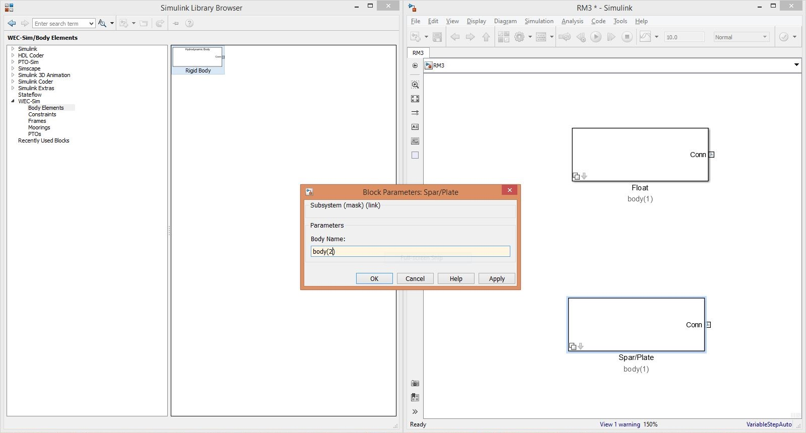
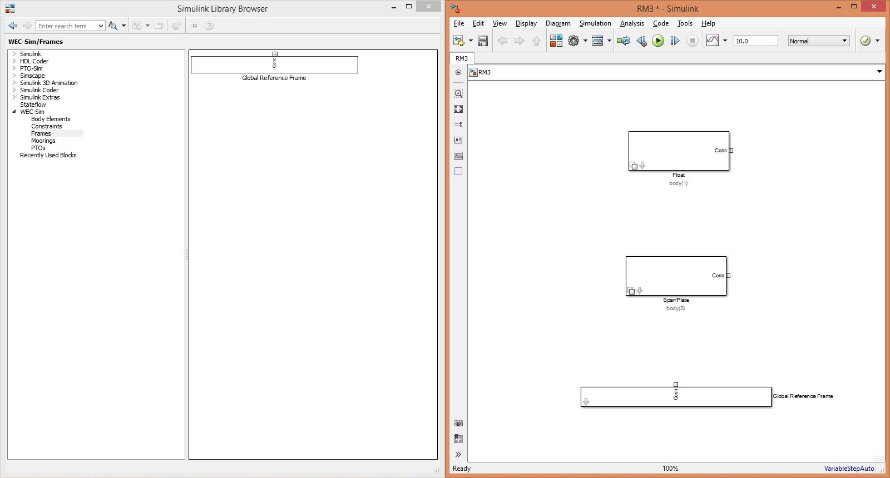
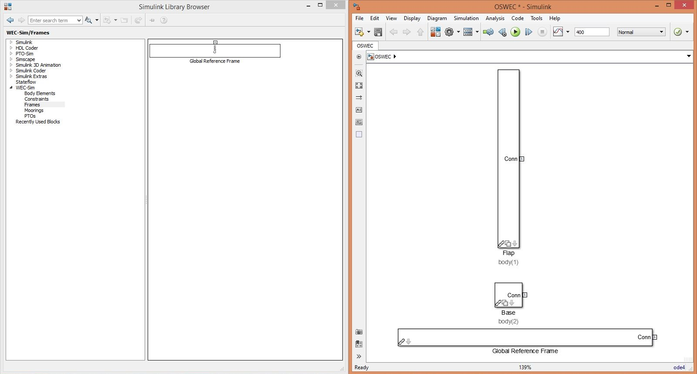
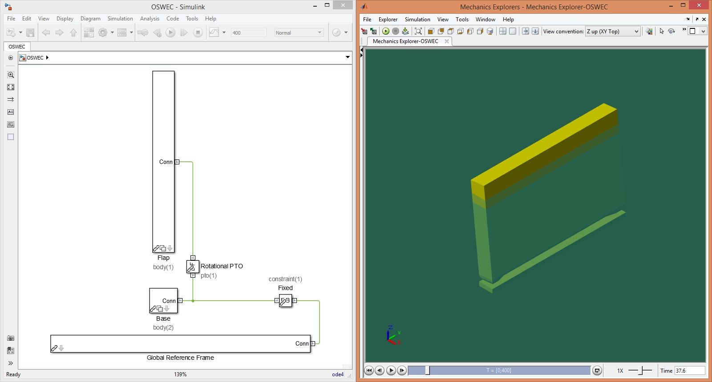

.. _tutorials:

Tutorials
=========
This section provides step-by-step instructions on how to run the WEC-Sim code using the provided Tutorials (located in the WEC-Sim ``$WECSIM/tutorials`` directory). 
Two WEC-Sim tutorials are provided: the Two-Body Point Absorber (RM3), and the Oscillating Surge WEC (OSWEC). 
For information about the implementation of the WEC-Sim code refer to the `Code Structure <http://wec-sim.github.io/WEC-Sim/code_structure.html>`_ section. 
For information about additional WEC-Sim features, refer to the `Advanced Features <http://wec-sim.github.io/WEC-Sim/advanced_features.html>`_ section. 

Two-Body Point Absorber (RM3)
----------------------------------
This section describes the application of the WEC-Sim code to model the Reference Model 3 (RM3) two-body point absorber WEC. 
This example application is provided in the WEC-Sim code release in the ``$WECSIM/tutorials`` directory.

Device Geometry
^^^^^^^^^^^^^^^^^^^^^^^
The RM3 two-body point absorber WEC has been characterized both numerically and experimentally as a result of the DOE-funded `Reference Model Project <http://energy.sandia.gov/rmp>`_. 
The RM3 is a two-body point absorber consisting of a float and a reaction plate. Full-scale dimensions of the RM3 and its mass properties are shown below.

.. figure:: _images/RM3_Geom.png
   :width: 300pt
   :align: center

+-------------------------------------------------+
|Float Full Scale Properties                      |
+======+=========+================================+
|      |Mass     |Moment of                       |
+CG (m)+(tonne)  +Inertia (kg-m^2)                +
+------+---------+----------+----------+----------+
|  0   |         |20,907,301|0         |0         |
+------+         +----------+----------+----------+
|  0   |727.01   |0         |21,306,091|0         |
+------+         +----------+----------+----------+
|-0.72 |         |0         |0         |37,085,481|
+------+---------+----------+----------+----------+   

+-------------------------------------------------+
|Plate Full Scale Properties                      |
+======+=========+================================+
|      |Mass     |Moment of                       |
+CG (m)+(tonne)  +Inertia (kg-m^2)                +
+------+---------+----------+----------+----------+
|  0   |         |94,419,615|0         |0         |
+------+         +----------+----------+----------+
|  0   |878.30   |0         |94,407,091|0         |
+------+         +----------+----------+----------+
|-21.29|         |0         |0         |28,542,225|
+------+---------+----------+----------+----------+ 

Model Files
^^^^^^^^^^^^^^^^^^^^^^^
Below is an overview of the files required to run the RM3 simulation in WEC-Sim. For the RM3 WEC, there are two corresponding geometry files: ``float.stl`` and ``plate.stl``. In addition to the required files listed below, users may supply a ``userDefinedFunctions.m`` file for post-processing results once the WEC-Sim run is complete. 

==================   =============================  =============================
**File Type**        **File Name**                  **Directory**
Input File           ``wecSimInputFile.m``          ``$WECSIM/tutorials/rm3/``
Simulink Model       ``rm3.slx``   		    ``$WECSIM/tutorials/rm3/``
Hydrodynamic Data    ``rm3.h5``    	            ``$WECSIM/tutorials/rm3/hydroData/``
Geometry Files       ``float.stl`` & ``plate.stl``  ``$WECSIM/tutorials/rm3/geometry/`` 
==================   =============================  =============================

RM3 Tutorial
^^^^^^^^^^^^^^^^^^^^^^^

Step 1: Run BEMIO
""""""""""""""""""""""""
Hydrodynamic data for each RM3 body must be parsed into a HDF5 file using `BEMIO <http://wec-sim.github.io/WEC-Sim/advanced_features.html#bemio>`_. 
BEMIO converts hydrodynamic data from WAMIT, NEMOH or AQWA into a HDF5 file, ``*.h5`` that is then read by WEC-Sim.
The RM3 tutorial includes data from a WAMIT run, ``rm3.out``, of the RM3 geometry in the ``$WECSIM/tutorials/rm3/hydroData/`` directory.
The RM3 WAMIT ``rm3.out`` file and the BEMIO ``bemio.m`` script are then used to generate the ``rm3.h5`` file. 

This is done by navigating to the ``$WECSIM/tutorials/rm3/hydroData/`` directory, and typing``bemio`` in the MATLAB Command Window::

	>> bemio
	

Step 2: Build Simulink Model
""""""""""""""""""""""""""""""""""""""""""""""""

The WEC-Sim Simulink model is created by dragging and dropping blocks from the *WEC-Sim Library* into the ``rm3.slx`` file. 

* Place two **Rigid Body** blocks from the *WEC-Sim Library* in the Simulink model file, one for each RM3 rigid body.

* Double click on the **Rigid Body** block, and rename each instance of the body. The first body must be called ``body(1)``, and the second body should be called ``body(2)``. 

* Place the **Global Reference Frame** from the *WEC-Sim Library* in the Simulink model file. The global reference frame acts as the seabed.

   

* Place the **Floating (3DOF)** block to connect the plate to the seabed. This constrains the plate to move in 3DOF relative to the **Global Reference Frame**. 

* Place the **Translational PTO** block to connect the float to the spar. This constrains the float to move in heave relative to the spar, and allows definition of PTO damping. 

.. figure:: _images/RM3_WECSim.JPG
   :width: 400pt
   :align: center

.. Note::

	When setting up a WEC-Sim model, it is very important to note the base and follower frames.

Step 3: Write wecSimInputFile.m
""""""""""""""""""""""""""""""""""""""""""""""""
The WEC-Sim input file defines simulation parameters, body properties, joints, and mooring for the RM3 model. The ``wecSimInputFile.m`` for the RM3 is provided in the RM3 case directory, and shown below.

.. literalinclude:: ../../WEC-Sim/tutorials/RM3/RM3_wecSimInputFile.m
   :language: matlab
      

Step 4: Run WEC-Sim
""""""""""""""""""""""""
To execute the WEC-Sim code for the RM3 tutorial, type ``wecSim`` into the MATLAB Command Window. Below is a figure showing the final RM3 Simulink model and the WEC-Sim GUI during the simulation. For more information on using WEC-Sim to model the RM3 device, refer to :cite:`ruehl_preliminary_2014`.

.. figure:: _images/RM3_WECSim_GUI.JPG
   :width: 400pt
   :align: center

Step 5: Post-processing
""""""""""""""""""""""""""""""""""""""""""""""""
The RM3 tutorial includes a ``userDefinedFunctions.m`` which plots RM3 forces and responses. This file can be modified by users for post-processing. Additionally, once the WEC-Sim run is complete, the WEC-Sim results are saved to the **output** variable in the MATLAB workspace.

  
Oscillating Surge WEC (OSWEC)
----------------------------------
This section describes the application of the WEC-Sim code to model the Oscillating Surge WEC (OSWEC). 
This example application is provided in the WEC-Sim code release in the ``$WECSIM/tutorials`` directory.

Device Geometry
^^^^^^^^^^^^^^^^^^^^^^^
The OSWEC was selected because its design is fundamentally different from the RM3. This is critical because WECs span an extensive design space, and it is important to model devices in WEC-Sim that operate under different principles.  The OSWEC is fixed to the ground and has a flap that is connected through a hinge to the base that restricts the flap in order to pitch about the hinge. The full-scale dimensions of the OSWEC and the mass properties are shown in the figure and table below.

.. figure:: _images/OSWEC_Geom.png
   :width: 300pt
   :align: center

+-----------------------------+
|Flap Full Scale Properties   |
+======+=========+============+
|      |         |Pitch Moment|
+CG (m)+Mass (kg)+of Inertia  +
|      |         |(kg-m^2)    |
+------+---------+------------+
|  0   |         |            |
+------+         +            +
|  0   |127,000  |1,850,000   |
+------+         +            +
| -3.9 |         |            |
+------+---------+------------+

Model Files
^^^^^^^^^^^^^^^^^^^^^^^
Below is an overview of the files required to run the OSWEC simulation in WEC-Sim. 
For the OSWEC, there are two corresponding geometry files: ``flap.stl`` and ``base.stl``. 
In addition to the required files listed below, users may supply a ``userDefinedFunctions.m`` file for post-processing results once the WEC-Sim run is complete. 

==================   ============================  ===============================
**File Type**        **File Name**                 **Directory**
Input File           ``wecSimInputFile.m``         ``$WECSIM/tutorials/oswec/``
Simulink Model       ``oswec.slx``   	           ``$WECSIM/tutorials/oswec/``
Hydrodynamic Data    ``oswec.h5``    	           ``$WECSIM/tutorials/oswec/hydroData/``
Geometry Files       ``flap.stl`` & ``base.stl``   ``$WECSIM/tutorials/oswec/geometry/``
==================   ============================  ===============================

OSWEC Tutorial
^^^^^^^^^^^^^^^^^^^^^^^

Step 1: Run BEMIO
""""""""""""""""""""""""
Hydrodynamic data for each OSWEC body must be parsed into a HDF5 file using `BEMIO <http://wec-sim.github.io/WEC-Sim/advanced_features.html#bemio>`_. 
BEMIO converts hydrodynamic data from WAMIT, NEMOH or AQWA into a HDF5 file, ``*.h5`` that is then read by WEC-Sim.
The OSWEC tutorial includes data from a WAMIT run, ``oswec.out``, of the OSWEC geometry in the ``$WECSIM/tutorials/rm3/hydroData/`` directory.
The OSWEC WAMIT ``oswec.out`` file and the BEMIO ``bemio.m`` script are then used to generate the ``oswec.h5`` file. 

This is done by navigating to the ``$WECSIM/tutorials/oswec/hydroData/`` directory, and typing``bemio`` in the MATLAB Command Window::

	>> bemio

Step 2: Build Simulink Model
""""""""""""""""""""""""""""""""""""""""""""""""
The WEC-Sim Simulink model is created by dragging and dropping blocks from the *WEC-Sim Library* into the ``oswec.slx`` file. 

* Place two **Rigid Body** blocks from the *WEC-Sim Library* in the Simulink model file, one for each OSWEC rigid body. 

* Double click on the **Rigid Body** block, and rename each instance of the body. The first body must be called ``body(1)``, and the second body should be called ``body(2)``. 
   
.. figure:: _images/OSWEC_WECSim_Body.jpg
   :width: 400pt  
   :align: center

* Place the **Global Reference Frame** from the *WEC-Sim Library* in the Simulink model file. The global reference frame acts as the seabed.

* Place the **Fixed** block to connect the base to the seabed. This constrains the base to be fixed relative to the **Global Reference Frame**. 

* Place a **Rotational PTO** block to connect the base to the flap. This constrains the flap to move in pitch relative to the base, and allows for the definition of PTO damping. 

.. figure:: _images/OSWEC_WECSim.JPG
   :width: 400pt
   :align: center

.. Note::

	When setting up a WEC-Sim model, it is very important to note the base and follower frames.

Step 3: Write wecSimInputFile.m
""""""""""""""""""""""""""""""""""""""""""""""""
The WEC-Sim input file defines simulation parameters, body properties, joints, and mooring for the OSWEC model. The ``wecSimInputFile.m`` for the OSWEC is provided in the OSWEC case directory, and shown below.

.. literalinclude:: ../../WEC-Sim/tutorials/OSWEC/OSWEC_wecSimInputFile.m
   :language: matlab

Step 4: Run WEC-Sim
""""""""""""""""""""""""
To execute the WEC-Sim code for the OSWEC tutorial, type ``wecSim`` into the MATLAB Command Window. Below is a figure showing the final OSWEC Simulink model and the WEC-Sim GUI during the simulation. For more information on using WEC-Sim to model the OSWEC device, refer to :cite:`y._yu_development_2014,y._yu_design_2014`.

Step 5: Post-processing
""""""""""""""""""""""""""""""""""""""""""""""""
The OSWEC tutorial includes a ``userDefinedFunctions.m`` which plots OSWEC forces and responses. This file can be modified by users for post-processing. Additionally, once the WEC-Sim run is complete, the WEC-Sim results are saved to the **output** variable in the MATLAB workspace.

WEC-Sim Examples
------------------------
Working examples of using WEC-Sim to model the RM3 and OSWEC are provided in the ``$WECSIM/examples/`` directory. 
For each example the ``wecSimInputFile.m`` provided includes examples of how to run different wave cases: 

* ``noWaveCIC`` - no wave with convolution integral calculation
* ``regularCIC`` - regular waves with convolution integral calculation
* ``irregular`` - irregular waves using a Pierson-Moskowitz spectrum with convolution integral calculation
* ``irregular`` - irregular waves using a Bretschneider Spectrum with state space calculation
* ``spectrumImport`` - irregular waves using a user-defined spectrum
* ``etaImport`` - user-defined time-series

Applications Repository
------------------------
The `WEC-Sim Applications <https://github.com/WEC-Sim/WEC-Sim_Applications>`_ repository contains applications of the WEC-Sim code, including tutorials by the WEC-Sim team as well as user-shared examples. The WEC-Sim Applications repository is included as a `submodule <https://git-scm.com/book/en/v2/Git-Tools-Submodules>`_ of the WEC-Sim repository.

References
------------------------
.. bibliography:: WEC-Sim_Tutorials.bib
   :style: unsrt   

