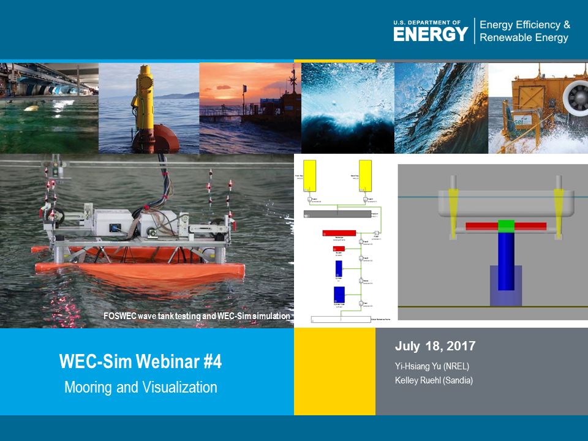

.. _webinars:

Webinars
=========
The WEC-Sim team is hosting a series of advanced features webinars.  Dates and topics are listed below. Once completed, the recordings and presentations will be posted to this page. 
	

	==================  ====================================		
	**Date**    	    **Topic**
	April 18, 2017      BEMIO and MCR
	May 24, 2017        Nonlinear Hydro, Non-hydro, and B2B
	June 13, 2017       PTO and Control
	July 18, 2017       Mooring and Vizualization
	August 17, 2017     WEC-Sim Training Course
	==================  ====================================
	

WEC-Sim Webinar #1 - BEMIO & MCR
-----------------------------------------

The presenation and recordings of WEC-Sim Webinar #1 on BEMIO & MCR hosted on April 18, 2017 are available below. Download the presentation by clicking the image below.

.. figure:: _static/WEC-Sim_Webinar1.png 
   :target: http://wec-sim.github.io/WEC-Sim/_downloads/WEC-Sim_Webinar1.pdf

WEC-Sim Webinar #1 - BEMIO (part 1)
~~~~~~~~~~~~~~~~~~~~~~~~~~~~~~~~~~~~
	
	.. raw:: html
	
		<iframe width="560" height="315" src="https://www.youtube.com/embed/ds7nibQx63g?ecver=1" frameborder="0" allowfullscreen></iframe>

WEC-Sim Webinar #1 - MCR (part 2)
~~~~~~~~~~~~~~~~~~~~~~~~~~~~~~~~~~~~

	.. raw:: html
	
		<iframe width="560" height="315" src="https://www.youtube.com/embed/C9R_mGNI5yA?ecver=1" frameborder="0" allowfullscreen></iframe>
		

WEC-Sim Webinar #2 - Nonlinear Hydro, Non-Hydro & B2B
-------------------------------------------------------

The presenation and recordings of WEC-Sim Webinar #2 on Nonlinear Hydro, Non-Hydro & B2B hosted on May 24, 2017 are available below. Download the presentation by clicking the image below.

.. figure:: _static/WEC-Sim_Webinar2.png   
   :target: http://wec-sim.github.io/WEC-Sim/_downloads/WEC-Sim_Webinar2.pdf

WEC-Sim Webinar #2 - Non-Linear Hydro (part 1)
~~~~~~~~~~~~~~~~~~~~~~~~~~~~~~~~~~~~~~~~~~~~~~~~~~~~
		
	.. raw:: html
	
		<iframe width="560" height="315" src="https://www.youtube.com/embed/jC2HIcy2E6M?ecver=1" frameborder="0" allowfullscreen></iframe>

WEC-Sim Webinar #2 - Non-Hydro & B2B (part 2)
~~~~~~~~~~~~~~~~~~~~~~~~~~~~~~~~~~~~~~~~~~~~~~~~~~~~
	
	.. raw:: html
	
		<iframe width="560" height="315" src="https://www.youtube.com/embed/RIPfL_nV00U?ecver=1" frameborder="0" allowfullscreen></iframe>
		
WEC-Sim Webinar #3 - PTO and Control
-------------------------------------

The presentation and recordings of WEC-Sim Webinar #3 on PTO and Control hosted on June 13, 2017 are available below. Download the presentation by clicking the image below.

.. figure:: _static/WEC-Sim_Webinar3.png   
   :target: http://wec-sim.github.io/WEC-Sim/_downloads/WEC-Sim_Webinar3.pdf

WEC-Sim Webinar #3 - PTO (part 1)
~~~~~~~~~~~~~~~~~~~~~~~~~~~~~~~~~~~~~~~~~~~~~~~~~~~~
		
	.. raw:: html
	
		<iframe width="560" height="315" src="https://www.youtube.com/embed/Q6_2ldauPSI?ecver=1" frameborder="0" allowfullscreen></iframe>

WEC-Sim Webinar #3 - Desalination Application (part 2)
~~~~~~~~~~~~~~~~~~~~~~~~~~~~~~~~~~~~~~~~~~~~~~~~~~~~~~
	
	.. raw:: html
		
		<iframe width="560" height="315" src="https://www.youtube.com/embed/Q7qb0eHg9-s" frameborder="0" allowfullscreen></iframe>
		
WEC-Sim Webinar #4 - Mooring and Visualization
-----------------------------------------------

The presentation and recordings of WEC-Sim Webinar #4 on Mooring and Visualization hosted on July 18, 2017 are available below. Download the presentation by clicking the image below.

   
   
   
WEC-Sim Webinar #4 - Mooring (part 1)
~~~~~~~~~~~~~~~~~~~~~~~~~~~~~~~~~~~~~~~~~~~~~~~~

	.. raw:: html
	
		<iframe width="560" height="315" src="https://www.youtube.com/embed/J22-9apMWm0" frameborder="0" allowfullscreen></iframe>
		
WEC-Sim Webinar #4 - Visualization (part 2)
~~~~~~~~~~~~~~~~~~~~~~~~~~~~~~~~~~~~~~~~~~~~~~~~

	.. raw:: html
	
		<iframe width="560" height="315" src="https://www.youtube.com/embed/z5BTQyfbXGo" frameborder="0" allowfullscreen></iframe>